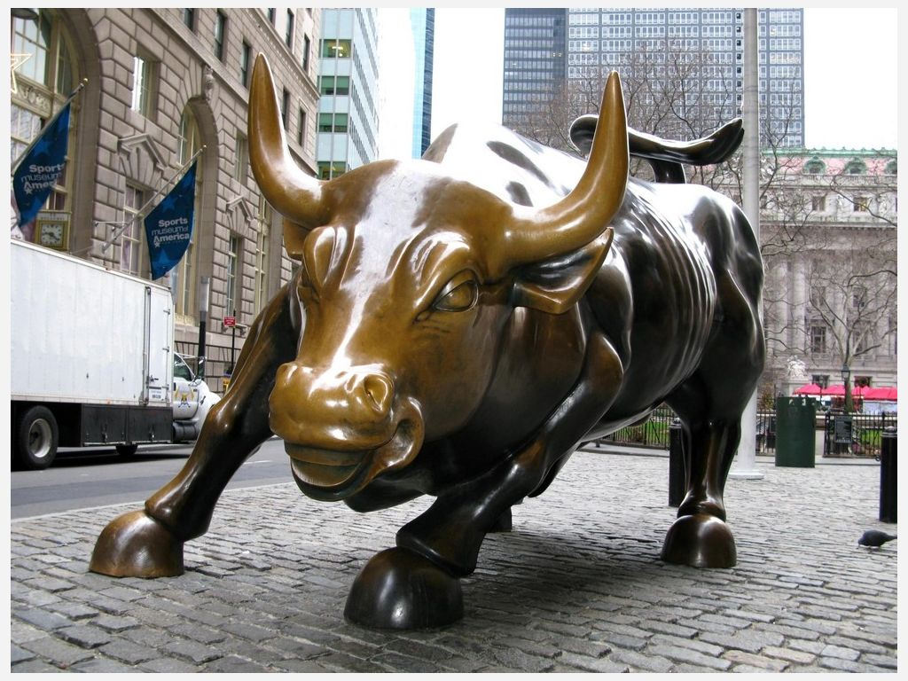

```{r setup, include=FALSE}
knitr::opts_chunk$set(echo=FALSE, fig.keep='high', out.width = '95%', fig.align = 'center', dev='cairo_pdf', warning = FALSE, message = FALSE)

#Load some packages
library(pacman)
pacman::p_load(tidyverse)
pacman::p_load(Quandl)
pacman::p_load(viridis)
pacman::p_load(Cairo)
options(kableExtra.latex.load_packages = TRUE)
pacman::p_load(kableExtra)

#Authentification
#Quandl.api_key("2xcmYFJoJKuEDwawuV7J")

#Basic setup for figures
source("Figures/Graph parameters.r")

```

# Definitions
-  An *option* on a futures contract gives its owner the right but not the obligation to enter a position on a futures contract at a predetermined price.
-  Options are derivatives because their value depends on the value of another asset, a futures contract in this case.
-  Options on futures contracts specify whether they are attached to a long or a short futures contract.


# Definitions
-  The seller of an option is also called the writer.
-  A *call* option specifies that the seller must deliver a *long* futures position to the option buyer.
-  A *put* option specifies that the seller must deliver a *short* futures position to the option buyer.
-  The seller of an option must provide the futures contract only if the buyer decides to exercise the option.
-  The seller is obligated to comply.

# Definitions

-  The owner of an *American option* can exercise the option within a certain period of time.
-  The owner of an *European option* can exercise the option only at its expiration.
-  We will focus on American options.

# Definitions
-  The *strike price* or the *exercise price* is the price of the futures contract when exercising the option.
-  The *premium* is the price of the option itself.

# Examples of options prices - CME website

-  See CME website [here](http://www.cmegroup.com/trading/agricultural/grain-and-oilseed/corn_quotes_globex_options.html) for prices of options on corn contracts.
-  See CME website [here](http://www.cmegroup.com/trading/agricultural/grain-and-oilseed/soybean_quotes_globex_options.html) for prices of options on soybeans contracts.

# Difference between futures contracts and options on futures

\begin{center}
Table: Difference between futures contracts and options on futures
\end{center}

\scriptsize

| Positions  | Trader's right | Trader's obligation | Margin required |
|:-------------|:-----------------|:--------------------|:-------------:|
| Futures contract buyer (long) |  | Accept commodity or financial asset at contract price or cash settle | Yes |
| Futures contract seller (short) |  | Deliver commodity or financial asset at contract price or cash settle | Yes |
| Put option buyer | Sell futures contract at strike price |   | No|
| Put option seller |   |  Buy futures contract at strike price | Yes|
| Call option buyer | Buy futures contract at strike price |   | No |
| Call option seller |   |Sell futures contract at strike price | Yes|

Source: @Carter2003

# What determines the value of an option?
-  The price of options is determined by the intersection of the demand and the supply.
-  The demand and supply for options are motivated by willingness to avoid price uncertainty through hedging or willingness to speculate.

# Futures price and options premium

\centering
Table: Futures price and options premium

\scriptsize

|          | Futures price declines   | Futures price increases   |
|:---------|:----------:|:-----------:|
| Call option premium | Declines | Increases |
| Put option premium | Increases | Declines |


# Why traders are willing to pay for an option?

-  The premium for an option has two components; the *intrinsic value* and the \emph{time value}: 
$$ \text{Premium = Intrinsic Value + Time Value}. $$
-  The intrinsic value is the difference between the strike price and the current futures contract price.
-  The time value is the amount that buyers are willing to pay because they expect that the price of futures will change favorably.


# Intrinsic value

-  The intrinsic value is the amount by which an option is *in the money*.

\centering
Table: In and out of the money

\scriptsize

|          | Call option | Put option   |
|:-------------|:--------------:|:---------------:|
| In the money (has intrinsic value) | Futures $>$ strike | Futures $<$ strike |
| At the money | Futures $=$ strike | Futures $=$ strike |
| Out of the money (no intrinsic value) | Futures $<$ strike | Futures $>$ strike |


# Example of intrinsic value: call option

\begin{table}
\begin{tabular}{l c c c }
  \toprule
    & Strike price & Futures price & Intrinsic value \\
  \midrule
  \multirow{2}{*}{Option 1} & \multirow{2}{*}{\$4.00} & \$4.25 & \$0.25 \\
    &  & \$4.75 & \$0.75 \\
  \midrule
  \multirow{2}{*}{Option 2} & \multirow{2}{*}{\$4.50} & \$4.25 & \$0.00 \\
    &  & \$4.75 & \$0.25 \\
  \midrule
  \multirow{2}{*}{Option 3} & \multirow{2}{*}{\$5.00} & \$4.25 & \$0.00 \\
    &  & \$4.75 & \$0.00 \\
  \bottomrule
\end{tabular}
\end{table}

# Example of intrinsic value: put option

\begin{table}
\begin{tabular}{l c c c }
  \toprule
    & Strike price & Futures price & Intrinsic value \\
  \midrule
  \multirow{2}{*}{Option 1} & \multirow{2}{*}{\$4.00} & \$4.25 & \$0.00 \\
    &  & \$4.75 & \$0.00 \\
  \midrule
  \multirow{2}{*}{Option 2} & \multirow{2}{*}{\$4.50} & \$4.25 & \$0.25 \\
    &  & \$4.75 & \$0.00 \\
  \midrule
  \multirow{2}{*}{Option 3} & \multirow{2}{*}{\$5.00} & \$4.25 & \$0.75 \\
    &  & \$4.75 & \$0.25 \\
  \bottomrule
\end{tabular}
\end{table}

# Call option payoff line

\begin{figure}[htbp]
\begin{center}
    \begin{picture}(240,180)
        %Axises and labels
        \scriptsize
        \put(0,90){\vector(1,0){240}} %x-axis
        \put(0,0){\line(0,1){180}} %y-axis
        \put(160,80){Futures price at exercise}
        \put(-5,170){\makebox(0,0){$+$}}
        \put(-5,5){\makebox(0,0){$-$}}
        \put(-5,90){\makebox(0,0){$0$}}
        %
        \thicklines
        \put(0,50){\line(1,0){80}}
        \put(80,50){\vector(1,1){100}}
        \multiput(80,0)(0,5){18}{\line(0,1){1.5}}%Dashed line
        \put(8,5){Out of the money}
        \put(95,5){In the money}
        \put(-2,70){\makebox(0,0){$\left\{\rule{0pt}{20pt}\right.$}}
        \put(-40,68){Premium}
        \put(78,88){$\bullet$}
        \put(70,110){\vector(1,-2){9}}
        \put(55,115){Strike price}
        \put(118,88){$\bullet$}
        \put(130,70){\vector(-1,2){9}}
        \put(110,60){Break-even price}
    \end{picture}
\vspace{0.1in}
\caption{Call option payoff line} \label{fig.call_option}
\end{center}
\end{figure}

# Put option payoff line

\begin{figure}[htbp]
\begin{center}
    \begin{picture}(240,180)
        %Axises and labels
        \scriptsize
        \put(0,90){\vector(1,0){240}} %x-axis
        \put(0,0){\line(0,1){180}} %y-axis
        \put(160,80){Futures price at exercise}
        \put(-5,170){\makebox(0,0){$+$}}
        \put(-5,5){\makebox(0,0){$-$}}
        \put(-5,90){\makebox(0,0){$0$}}
        %
        \thicklines
        \put(100,50){\line(1,0){120}}
        \put(100,50){\vector(-1,1){80}}
        \multiput(100,0)(0,5){18}{\line(0,1){1.5}}%Dashed line
        \multiput(0,50)(5,0){20}{\line(1,0){1.5}}%Dashed line
        \put(18,5){In the money}
        \put(115,5){Out of the money}
        \put(-2,70){\makebox(0,0){$\left\{\rule{0pt}{20pt}\right.$}}
        \put(-40,68){Premium}
        \put(98,88){$\bullet$}
        \put(110,110){\vector(-1,-2){9}}
        \put(101,115){Strike price}
        \put(58,88){$\bullet$}
        \put(50,70){\vector(1,2){9}}
        \put(20,63){Break-even price}
    \end{picture}
\vspace{0.1in}
\caption{Put option payoff line} \label{fig.put_option}
\end{center}
\end{figure}


# Time value

-  The time value represents the expectations regarding the price of a futures contract to exceed the strike price for a call option or to fall below the strike price of a put option.
-  We know the price of an option (premium) and can calculate the intrinsic value.
-  The time value is: $$\text{Time Value = Premium - Intrinsic Value}.$$


# Time value of an option

\begin{figure}[htbp]
\begin{center}
    \begin{picture}(240,180)
        %Axises and labels
        \scriptsize
        \put(0,0){\vector(1,0){240}} %x-axis
        \put(0,0){\vector(0,1){180}} %y-axis
        \put(220,-10){Time}
        \put(150,-10){Expiration date}
        \put(195,-2){\line(0,1){2}}
        \put(-25,170){\makebox(0,0){Time value}}
        %
        \thicklines
        \qbezier(0, 160)(160, 140)(195, 0)
    \end{picture}
\vspace{0.1in}
\caption{Decaying value of an option} \label{fig.time_value}
\end{center}
\end{figure}


# Time value of options

-  Time adds value to an option.
-  The more time before the expiration of an option, the greater is the probability that the option falls in the money and the greater the probability that the option is in the money by much.
-  The more volatile is the price of the underlying futures contract, the greater is the time value of an option.
-  An option is a decaying asset because its time value declines as it approaches its expiration.
-  At expiration, the time value of an option is zero.


# In practice,how does the price of an option changes?

-  The following figures are for options on the December futures contract for corn.
-  The option expired on November 20, 2015.
-  The graphs are for options with different strike prices.


```{r, echo = FALSE, results="hide"} 
library(pacman)
suppressMessages(source("R code/5) Option graphs.R"))
```

# Price of corn in fall 2017
```{r figure_corn_futures, fig.keep='high', echo=FALSE, fig.width=6, fig.height=4, dev="cairo_pdf"}
print(price_plot)
```


# Call option premium
```{r call_premium,fig.keep='high', echo=FALSE, fig.width=6, fig.height=4, dev="cairo_pdf"}
print(call_plot)
```


# Put option premium
```{r put_premium,fig.keep='high', echo=FALSE, fig.width=6, fig.height=4, dev="cairo_pdf"}
print(put_plot)
```


# Call option intrinsic value
```{r call_intrinsic,fig.keep='high', echo=FALSE, fig.width=6, fig.height=4, dev="cairo_pdf"}
print(call_plot_intrinsic)
```


# Put option intrinsic value
```{r put_intrinsic,fig.keep='high', echo=FALSE, fig.width=6, fig.height=4, dev="cairo_pdf"}
print(put_plot_intrinsic)
```


# Call option time value
```{r call_time,fig.keep='high', echo=FALSE, fig.width=6, fig.height=4, dev="cairo_pdf"}
print(call_plot_time)
```


# Put option time value
```{r put_time,fig.keep='high', echo=FALSE, fig.width=6, fig.height=4, dev="cairo_pdf"}
print(put_plot_time)
```


# Time value

-  Some of these options are not traded very frequently.
-  This means that the time values calculated in the previous do not always reflect the value of time alone.
-  The corn price used for the calculations is the closing price. The last transaction for some options might have occurred quite some time before at a different corn price.
-  This means that the time values, in the two previous graphs, are calculated with less precision.
-  You expect the time value to decline over time, and this is what the previous graphs show.


# Price limits for options: call

-  The maximum value of a call option is the price of the futures:
    -  Even if the strike price is zero, no buyer would pay more than the price of the futures.

-  The minimum price of a call option is the intrinsic value, if any:
    -  If the time value equals zero, than a buyer would not pay more than the intrinsic value.


# Price limits for options: put

-  The maximum value of a put option is the strike price:
    -  The maximum value of a put option is when the price of the futures contract equals zero.
-  The minimum price of a put option is the intrinsic value, if any:
    -  If the time value equals zero, than a buyer would not pay more than the intrinsic value.


# Maximum and minimum price for options

\begin{center}
Table: Maximum and minimum price for options
\end{center}

\begin{table}
\scriptsize
\begin{tabular}{l c c }
  \toprule
    & Call option & Put option \\
  \midrule
  Max. price & Futures price & Strike price\\
  \addlinespace[0.075in]
  Min. price & Max[0, (futures price - strike price)] & Max[0, (strike price - futures price)]\\
  \bottomrule
\end{tabular}
\end{table}

# Speculation using options

-  Speculation is an attempt to profit from movements in the price of assets.
-  Speculation using futures is relatively straightforward:
    -  The seller of a futures contract, short position, gains if the price declines.
    -  The buyer of a futures contract, long position, gains  if the price increases.
-  For options, gains are directly related to the price of the underlying futures contract.

# Definitions

-  A *bear market* is when the price of a commodity declines.
    -  If you are attacked by a bear, it will strike you DOWN with its claws.
    -  A speculator who takes a bearish position expects the price of a commodity to decline.
-  A *bull market* is when the price of a commodity increases.
    -  If you are attacked by a bull, it will strike you UP with its horns.
    -  A speculator who takes a bullish position expects the price of a commodity to increase.


# Wall Street bull
```{r bull, echo=FALSE, out.width = '75%'}

```


# Position and price expectations

\begin{center}
Table: Position and price expectations
\end{center}


|              | Call option | Put option   |
|:-------------|:--------------:|:---------------:|
| Buyer | Bullish | Bearish  |
| Seller | Neutral to bearish | Neutral to bullish|

# Why are sellers of options neutral?

-  The seller of an option immediately receives the premium.
-  Thus, a seller makes an immediate gain from selling the option.
-  Future losses depend on the movement of the underlying contract.
-  Given that losses are possible, and that underlying the option there is a futures contract, the seller of an option must have a margin account.
-  The option may never be exercised.


# Payoffs from call option
\begin{figure}[htbp]
\begin{center}
    \begin{picture}(240,180)
        %Axises and labels
        \scriptsize
        \put(0,90){\vector(1,0){240}} %x-axis
        \put(0,0){\line(0,1){180}} %y-axis
        \put(160,80){Futures price at exercise}
        \put(-5,170){\makebox(0,0){$+$}}
        \put(-5,5){\makebox(0,0){$-$}}
        \put(-5,90){\makebox(0,0){$0$}}
        \thicklines
        %Call option buyer
        \color{red}
        \multiput(0,50)(5,0){16}{\line(1,0){1.5}}%Dashed line
        \put(175,145){\vector(1,1){5}}
        \multiput(80,50)(5,5){20}{\line(1,1){1.5}}%Dashed line
        \put(170,155){Call option \textcolor[rgb]{0.00,0.00,1.00}{buyer}}
        %Call option seller
        \color{black}
        \put(0,130){\line(1,0){80}}
        \put(80,130){\vector(1,-1){100}}
        \put(170,20){Call option \textcolor[rgb]{0.00,0.00,1.00}{seller}}
        \multiput(80,0)(0,5){36}{\line(0,1){1.5}}%Dashed line
        \put(8,5){Out of the money}
        \put(95,5){In the money}
        \put(-2,70){\makebox(0,0){$\left\{\rule{0pt}{20pt}\right.$}}
        \put(-40,68){Premium}
        \put(-2,110){\makebox(0,0){$\left\{\rule{0pt}{20pt}\right.$}}
        \put(-40,108){Premium}
        \put(78,88){$\bullet$}
        \put(118,88){$\bullet$}
    \end{picture}
\vspace{0.1in}
\caption{Call option payoff line}
\end{center}
\end{figure}


# Payoffs from put option
\begin{figure}[htbp]
\begin{center}
    \begin{picture}(240,180)
        %Axises and labels
        \scriptsize
        \put(0,90){\vector(1,0){240}} %x-axis
        \put(0,0){\line(0,1){180}} %y-axis
        \put(160,80){Futures price at exercise}
        \put(-5,170){\makebox(0,0){$+$}}
        \put(-5,5){\makebox(0,0){$-$}}
        \put(-5,90){\makebox(0,0){$0$}}
        \thicklines
        %Put option buyer
        \color{red}
        \multiput(100,50)(5,0){24}{\line(1,0){1.5}}%Dashed line
        \put(25,125){\vector(-1,1){5}}
        \multiput(100,50)(-5,5){16}{\line(-1,1){1.5}}%Dashed line
        \put(10,135){Put option \textcolor[rgb]{0.00,0.00,1.00}{buyer}}
        %Put option seller
        \color{black}
        \put(100,130){\line(1,0){120}}
        \put(100,130){\vector(-1,-1){80}}
        \put(10,40){Put option \textcolor[rgb]{0.00,0.00,1.00}{seller}}
        \multiput(100,0)(0,5){36}{\line(0,1){1.5}}%Dashed line
        \put(18,5){In the money}
        \put(115,5){Out of the money}
        \put(-2,70){\makebox(0,0){$\left\{\rule{0pt}{20pt}\right.$}}
        \put(-40,68){Premium}
        \put(-2,110){\makebox(0,0){$\left\{\rule{0pt}{20pt}\right.$}}
        \put(-40,108){Premium}
        \put(98,88){$\bullet$}
        \put(58,88){$\bullet$}
    \end{picture}
\vspace{0.1in}
\caption{Payoffs from put option} \label{fig.put_option_pay}
\end{center}
\end{figure}


