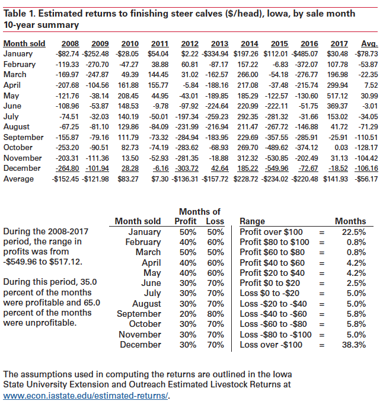

```{r setup, include=FALSE}
knitr::opts_chunk$set(echo=FALSE, fig.keep='high', out.width = '95%', fig.align = 'center', dev='cairo_pdf', warning = FALSE, message = FALSE)

#Load some packages
library(pacman)
pacman::p_load(tidyverse)
pacman::p_load(lubridate)
pacman::p_load(readxl)
pacman::p_load(Quandl)
pacman::p_load(viridis)
pacman::p_load(Cairo)
options(kableExtra.latex.load_packages = TRUE)
pacman::p_load(kableExtra)
pacman::p_load(ggmap)
pacman::p_load(sp)
pacman::p_load(usmap)
pacman::p_load(maps)
pacman::p_load(magick)

#Authentification
#Quandl.api_key("2xcmYFJoJKuEDwawuV7J")

#Basic setup for figures
source("Figures/Graph parameters.r")

```

# Introduction

- The United States is the largest producer of cattle and beef in the world.
- The supply chain for cattle and beef is more complicated than for grains.
- Production dynamics is also different than grains and has an important impact on cattle and beef markets.
- Characteristics of cattle are also more difficult to observe than for grains, a more uniform product.

# Resources

-  [Information about livestock farming](https://www.extension.iastate.edu/agdm/ldfirst.html) from ISU extension.
-  [Cattle Markets and the Livestock Crush](http://mindymallory.com/PriceAnalysis/cattle-markets-and-the-livestock-crush.html) from Mindy Mallory textbook.

# Definitions 

- Cattle: Live animal;
- Beef: Meat from cattle;
- Cow: mature female able of producing calves;
- Bull: uncastrated male;
- Calf: young cattle before weaning;
- Weaned calf: calf after being removed from a cow;
- Steer: young male cattle castrated;
- Heiffer: young female, before having a first calf;
- Feeder cattle: cattle ready to be placed on feed in a feedlot;
- Fed/slaughter cattle: cattle ready for *harvest*;
- Boxed beef: beef ready to be sold at retail.

# Supply chain {.allowframebreaks}

- Cow-calf operations:
    - Sell weaned calves (6-7 months of age);
    - Usually smaller operations;
    - For example, corn growers diversifying their operation.
- Stocker (spring) - backgrounding (fall):
    - Stockers use pasture;
    - Backgrounders use feeds;
    - Buy weaned calves;
    - Sell feeder cattle (about a year old).
- Feedlots - finishing:
    - Buy feeder cattle;
    - Sell fed/slaughter cattle (18 to 24 months old);
    - Can be very large (over 100,000 heads).
\framebreak
- Packing/slaughter plant:
    - Buy fed cattle;
    - Sell boxed beef.
- Retail/food service:
    - Buy boxed beef;
    - Sell beef to consumers.

# Annual commercial steer and heiffer slaughter

```{r slaughter, out.width = '75%'}

if(Sys.time() - file.info("Data/7) Slaughter.xlsx")$mtime > months(1, abbreviate = FALSE)){
  download.file("https://www.ers.usda.gov/webdocs/DataFiles/90207/SlaughterCounts%20Pivot.xlsx", "Data/7) Slaughter.xlsx", method = "curl")  
}

dta <- read_excel("Data/7) Slaughter.xlsx", sheet = "Data sheet (machine readable)") %>%
  dplyr::filter(`Time period description` == "Month", Commodity %in% c("Cattle, Steers", "Cattle, Heifers")) %>%
  dplyr::select(Date, Value) %>%
  mutate(Date = as.Date(Date), year = year(Date), Value = Value/1000) %>%
  group_by(year) %>%
  summarize(Value = sum(Value)) %>%
  dplyr::filter(year < year(Sys.time()), year >= 1970)
  
 
plot_slaughter <- ggplot(dta, aes(x = year, y = Value)) +
  geom_line(color = "blue", size = 1) +
  ylab("Cattle slaughter (million head)") +
  scale_x_continuous(breaks = seq(1970, 2020, by = 5)) +
  theme_bw() + mytheme +
  theme(axis.title.x=element_blank(), axis.line = element_line(color='black'))

plot_slaughter

```
Data source: @USDA_dom.


# Annual beef production

```{r beef, out.width = '75%'}

if(Sys.time() - file.info("Data/7) Beef.xlsx")$mtime > months(1, abbreviate = FALSE)){
  download.file("https://www.ers.usda.gov/webdocs/DataFiles/90207/Beef%20Pivot.xlsx", "Data/7) Beef.xlsx", method = "curl")  
}

dta <- read_excel("Data/7) Beef.xlsx", sheet = "Data sheet (machine readable)") %>%
  dplyr::filter(`Statistic type` == "Total production",
                `Time period` == "Yr Jan-Dec",
                Commodity == "Beef") %>%
  dplyr::select(Year, Value) 

plot_beef <- ggplot(dta, aes(x = Year, y = Value)) +
  geom_line(color = "blue", size = 1) +
  ylab("Beef production (million pounds)") +
  scale_x_continuous(breaks = seq(1970, 2020, by = 5)) +
  theme_bw() + mytheme +
  theme(axis.title.x=element_blank(), axis.line = element_line(color='black'))

plot_beef

```
Data source: @USDA_dom.

# Average live and dressed cattle weight in federally inspected facility

```{r weight, out.width = '75%'}

if(Sys.time() - file.info("Data/7) Weight.xlsx")$mtime > months(1, abbreviate = FALSE)){
  download.file("https://www.ers.usda.gov/webdocs/DataFiles/90207/SlaughterWeights%20Pivot.xlsx", "Data/7) Weight.xlsx", method = "curl")
}

dta <- read_excel("Data/7) Weight.xlsx", sheet = "Data sheet (machine readable)") %>%
  dplyr::filter(`Time period description` == "Month", 
                Commodity == "Cattle") %>%
  dplyr::select(Date, Value, Unit) %>%
  mutate(Date = as.Date(Date), 
         year = year(Date), 
         Unit = ifelse(Unit == "LB / HEAD, DRESSED BASIS", "Dressed", "Live")) %>% 
  group_by(Date, Unit) %>%
  summarize(Value = mean(Value)) %>%
  dplyr::filter(year(Date) >= 1970)

plot_weight <- ggplot(dta, aes(x = Date, y = Value, color = Unit)) +
  geom_line(size = 1) +
  ylab("Weight in pound") +
  scale_color_manual(values = viridis(3)[c(1,2)]) +
  scale_x_date(breaks = seq(as.Date("1970-01-01"), as.Date("2020-12-31"), by="5 years"), date_labels = "%Y") +
  theme_bw() + mytheme +
  theme(axis.title.x=element_blank(), 
        axis.line = element_line(color='black'),
        legend.position = c(0.10, 0.90))

plot_weight

```
Data source: @USDA_dom.

# Average carcass yield (live weight/dressed weight)

```{r yield, out.width = '75%'}

dta <- dta %>% 
  spread(Unit, Value) %>%
  mutate(yield = Dressed/Live)

plot_yield <- ggplot(dta, aes(x = Date, y = yield)) +
  geom_line(color = "blue", size = 1) +
  ylab("Yield") +
  scale_x_date(breaks = seq(as.Date("1970-01-01"), as.Date("2020-12-31"), by="5 years"), date_labels = "%Y") +
  theme_bw() + mytheme +
  theme(axis.title.x=element_blank(), 
        axis.line = element_line(color='black'),
        legend.position = c(0.10, 0.90))

plot_yield

```
Data source: @USDA_dom.

# Operations with cattle inventory by county (2012 census of agriculture)

```{r, out.width = '75%'}

# Read data
dta <- read_csv("Data/7) Cattle inventory by county.csv")
dta <- dta %>%
  dplyr::filter(State != "ALASKA" & State != "HAWAII") %>%
  dplyr::select(State, Value, `Ag District`, County) %>%
  mutate(Value = str_replace_all(Value, ",", ""), 
         Value = round(as.numeric(Value)),
         state_county = paste(tolower(State), tolower(County), sep = "_"),
         state_county = str_replace(state_county, "_saint", "_st"),
         state_county = str_replace(state_county, "_st[.]", "_st"),
         state_county = str_replace(state_county, "le flore", "leflore"),
         state_county = str_replace(state_county, "oklahoma_leflore", "oklahoma_le flore"),
         state_county = str_replace(state_county, "suffolk city", "suffolk"),
         state_county = str_replace(state_county, "o brien", "obrien"),
         state_county = str_replace(state_county, "virginia beach city", "virginia beach")) %>%
  dplyr::filter(!is.na(Value), Value>0, 
                state_county != "arizona_lapaz",
                state_county != "south dakota_oglala lakota",
                state_county != "virginia_chesapeake city") %>%
  group_by(state_county) %>%
  summarize(Value = sum(Value)) %>%
  ungroup() %>%
  mutate(Value = round(Value/25)) %>%
  dplyr::filter(!is.na(Value), Value>0)

# Get county and state boundaries
countyShapes <- map("county", plot = FALSE, fill = TRUE)
countyShapes <- fortify(countyShapes)
countyShapes <- countyShapes %>%
  mutate(state_county = paste(tolower(region), tolower(subregion), sep = "_"))

stateShapes <- map("state", plot = FALSE, fill = TRUE)
stateShapes <- fortify(stateShapes)

# Get number of point per county

rm(p_dta, p_dta0)

for (i in 1:nrow(dta)){
  countyShapeFrame <- countyShapes[countyShapes$state_county == dta$state_county[i], ]

  countyPoly <- Polygons(lapply(split(countyShapeFrame[, c("long", "lat")], countyShapeFrame$group), Polygon), ID = "b")

  p_dta0 <- spsample(countyPoly, n = dta$Value[i], "random") %>%
    as.data.frame() %>%
    rename(longitude = x, latitude = y) %>%
    mutate(state_county = dta$state_county[i])

  if(!exists("p_dta")){p_dta <- p_dta0}
  if(exists("p_dta")){p_dta <- rbind(p_dta,p_dta0)}

}

us_county_map <- map_data('county')
us_state_map <- map_data('state')

d_inv <- ggplot() +
  geom_polygon(data=us_county_map, aes(x=long, y=lat, group = group), fill = NA, color = "gray") +
  geom_point(data = p_dta, mapping = aes(longitude, latitude), shape=16, alpha = 0.50, color = "blue", size = 0.25) + 
  scale_size_continuous(range = c(0.1, 1)) +
  geom_polygon(data=us_state_map, aes(x=long, y=lat, group = group), fill = NA, color = "black") +
  coord_map( "polyconic" ) +
  theme_bw() +
  mytheme +
  theme(axis.line = element_blank(),
        axis.ticks = element_blank(),
        axis.text = element_blank(),
        axis.title = element_blank(),
        panel.grid = element_blank(),
        strip.background = element_blank(),
        panel.spacing.x=unit(-2, "lines"),
        panel.spacing.y=unit(0,"lines"),
        plot.margin=unit(c(0,-1,0,-1),"lines"),
        legend.text=element_text(size=8),
        legend.key.width = unit(0.4, "cm"),
        legend.key.height = unit(0.4, "cm"))
d_inv

```
\scriptsize
This is a density dot map where each dot represents about 25 operations, randomly located within a county. Data source: @NASS.

# Operations with cattle on feed by county (2012 census of agriculture)

```{r, out.width = '75%'}

# Read data
dta <- read_csv("Data/7) Cattle on feed by county.csv")
dta <- dta %>%
  dplyr::filter(State != "ALASKA" & State != "HAWAII") %>%
  dplyr::select(State, Value, `Ag District`, County) %>%
  mutate(Value = str_replace_all(Value, ",", ""), 
         Value = round(as.numeric(Value)),
         state_county = paste(tolower(State), tolower(County), sep = "_"),
         state_county = str_replace(state_county, "_saint", "_st"),
         state_county = str_replace(state_county, "_st[.]", "_st"),
         state_county = str_replace(state_county, "le flore", "leflore"),
         state_county = str_replace(state_county, "oklahoma_leflore", "oklahoma_le flore"),
         state_county = str_replace(state_county, "suffolk city", "suffolk"),
         state_county = str_replace(state_county, "o brien", "obrien"),
         state_county = str_replace(state_county, "virginia beach city", "virginia beach")) %>%
  dplyr::filter(!is.na(Value), Value>0, 
                state_county != "arizona_lapaz",
                state_county != "south dakota_oglala lakota",
                state_county != "virginia_chesapeake city") %>%
  group_by(state_county) %>%
  summarize(Value = sum(Value)) %>%
  ungroup() %>%
  mutate(Value = round(Value/10)) %>%
  dplyr::filter(!is.na(Value), Value>0)

# Get county and state boundaries
countyShapes <- map("county", plot = FALSE, fill = TRUE)
countyShapes <- fortify(countyShapes)
countyShapes <- countyShapes %>%
  mutate(state_county = paste(tolower(region), tolower(subregion), sep = "_"))

stateShapes <- map("state", plot = FALSE, fill = TRUE)
stateShapes <- fortify(stateShapes)

# Get number of point per county
rm(p_dta, p_dta0)
for (i in 1:nrow(dta)){
  countyShapeFrame <- countyShapes[countyShapes$state_county == dta$state_county[i], ]

  countyPoly <- Polygons(lapply(split(countyShapeFrame[, c("long", "lat")], countyShapeFrame$group), Polygon), ID = "b")

  p_dta0 <- spsample(countyPoly, n = dta$Value[i], "random") %>%
    as.data.frame() %>%
    rename(longitude = x, latitude = y) %>%
    mutate(state_county = dta$state_county[i])

  if(!exists("p_dta")){p_dta <- p_dta0}
  if(exists("p_dta")){p_dta <- rbind(p_dta,p_dta0)}

}

us_county_map <- map_data('county')
us_state_map <- map_data('state')

d_inv <- ggplot() +
  geom_polygon(data=us_county_map, aes(x=long, y=lat, group = group), fill = NA, color = "gray") +
  geom_point(data = p_dta, mapping = aes(longitude, latitude), shape=16, size = 0.50, alpha = 0.5, color = "blue", size = 0.15) +
  geom_polygon(data=us_state_map, aes(x=long, y=lat, group = group), fill = NA, color = "black") +
  coord_map( "polyconic" ) +
  theme_bw() +
  mytheme +
  theme(axis.line = element_blank(),
        axis.ticks = element_blank(),
        axis.text = element_blank(),
        axis.title = element_blank(),
        panel.grid = element_blank(),
        strip.background = element_blank(),
        panel.spacing.x=unit(-2, "lines"),
        panel.spacing.y=unit(0,"lines"),
        plot.margin=unit(c(0,-1,0,-1),"lines"),
        legend.text=element_text(size=8),
        legend.key.width = unit(0.4, "cm"),
        legend.key.height = unit(0.4, "cm"))
d_inv

```
\scriptsize
This is a density dot map where each dot represents about 10 operations, randomly located within a county. Data source: @NASS.


# Cattle slaughter (500 lb and more) by state (2017)

```{r, out.width = '75%'}

# Read data
dta <- read_csv("Data/7) Cattle slaughter by state.csv")
dta <- dta %>%
  dplyr::select(State, Value) %>%
  dplyr::filter(State != "ALASKA" & State != "HAWAII") %>%
  mutate(Value = str_replace_all(Value, ",", ""), 
         Value = as.numeric(Value)/5000)  %>%
  dplyr::filter(!is.na(Value))

# Get state boundaries
stateShapes <- map("state", plot = FALSE, fill = TRUE)
stateShapes <- fortify(stateShapes)

# Get random of point per state
rm(p_dta, p_dta0)

for (i in 1:nrow(dta)){
  stateShapeFrame <- stateShapes[stateShapes$region == tolower(dta$State)[i], ]

  statePoly <- Polygons(lapply(split(stateShapeFrame[, c("long", "lat")], stateShapeFrame$group), Polygon), ID = "b")

  p_dta0 <- spsample(statePoly, n = dta$Value[i], "random") %>%
    as.data.frame() %>%
    rename(longitude = x, latitude = y) %>%
    mutate(state = tolower(dta$State[i]))

  if(!exists("p_dta")){p_dta <- p_dta0}
  if(exists("p_dta")){p_dta <- rbind(p_dta,p_dta0)}

}

d_slaughter <- ggplot() +
  geom_polygon(data=us_state_map, aes(x=long, y=lat, group = group), fill = NA, color = "black") +
  geom_point(data = p_dta, mapping = aes(longitude, latitude), shape=16, size = 0.50, alpha = 0.5, color = "blue") +
  coord_map( "polyconic" ) +
  theme_bw() +
  mytheme +
  theme(axis.line = element_blank(),
        axis.ticks = element_blank(),
        axis.text = element_blank(),
        axis.title = element_blank(),
        panel.grid = element_blank(),
        strip.background = element_blank(),
        panel.spacing.x=unit(-2, "lines"),
        panel.spacing.y=unit(0,"lines"),
        plot.margin=unit(c(0,-1,0,-1),"lines"),
        legend.text=element_text(size=8),
        legend.key.width = unit(0.4, "cm"),
        legend.key.height = unit(0.4, "cm"))


d_slaughter

```
\scriptsize
This is a density dot map where each dot represents about 5,000 heads, randomly located within a state. Date source: @NASS.

# Annual imports of cattle over 700 lb

```{r, out.width = '75%'}

if(Sys.time() - file.info("Data/7) Cattle trade.xls")$mtime > months(1, abbreviate = FALSE)){
  download.file("https://www.ers.usda.gov/webdocs/DataFiles/81475/Cattle_YearlyFull.xls", "Data/7) Cattle trade.xls", method = "curl")
}

dta <- read_excel("Data/7) Cattle trade.xls", col_names = FALSE)

dta <- dta[c(2,34:35),] %>%
  dplyr::select(-X__1, -X__2)

colnames(dta) <- c("Country", dta[1,2:ncol(dta)])

dta <- dta[2:3,]
  
dta <- dta %>% 
  gather(year, value,-Country) %>%
  mutate(year = as.numeric(year), value = as.numeric(value)) %>%
  replace_na(list(value = 0))

plot_import <- ggplot(dta, aes(x = year, y = value, fill = Country)) +
  geom_area(position = "stack", alpha = 0.75) +
  geom_line(position = "stack", size = 0.5, color = "black") +
  scale_fill_manual(values = viridis(3)[c(1,2)]) +
  ylab("Imports of cattle over 700 lb") +
  scale_x_continuous(breaks = seq(1990, 2015, by = 5), expand = c(0,0)) + 
  scale_y_continuous(expand = c(0,0)) +
  theme_bw() + mytheme +
  theme(axis.title.x=element_blank(), 
        axis.line = element_line(color='black'),
        legend.position = c(0.1, 0.9),
        legend.direction = "vertical")

plot_import


```
\scriptsize
Most are fed cattle for slaughter. Source: @usda_trade.

# Annual imports of feeder cattle (400 to 700 lb)

```{r, out.width = '75%'}
dta <- read_excel("Data/7) Cattle trade.xls", col_names = FALSE)

dta <- dta[c(2,27:28),] %>%
  dplyr::select(-X__1, -X__2)

colnames(dta) <- c("Country", dta[1,2:ncol(dta)])

dta <- dta[2:3,]
  
dta <- dta %>% 
  gather(year, value,-Country) %>%
  mutate(year = as.numeric(year), value = as.numeric(value)) %>%
  replace_na(list(value = 0))


plot_import <- ggplot(dta, aes(x = year, y = value,  fill = Country)) +
  geom_area(position = "stack", alpha = 0.75) +
  geom_line(position = "stack", size = 0.5, color = "black", alpha = 0.75) +
  scale_fill_manual(values = viridis(3)[c(1,2)]) +
  ylab("Imports of feeder cattle (400 to 700 lb)") +
  scale_x_continuous(breaks = seq(1990, 2015, by = 5), expand = c(0,0)) + 
  scale_y_continuous(expand = c(0,0)) +
  theme_bw() + mytheme +
  theme(axis.title.x=element_blank(), 
        axis.line = element_line(color='black'),
        legend.position = c(0.1, 0.9),
        legend.direction = "vertical")

plot_import

```
\scriptsize
Most are feeder cattle for placement. Data source: @usda_trade.

# Annual exports of cattle (all weight)

```{r, out.width = '75%'}

dta <- read_excel("Data/7) Cattle trade.xls", col_names = FALSE)

dta <- dta[c(2,46:150),] %>%
  dplyr::select(-X__1, -X__2)

colnames(dta) <- c("Country", dta[1,2:ncol(dta)])

dta <- dta[-1,]
  
dta <- dta %>% 
  gather(year, value,-Country) %>%
  mutate(Country = case_when(Country == "Canada" ~ "Canada",
                             Country == "Mexico" ~ "Mexico",
                             TRUE ~ "Other countries"),
         value = as.numeric(value),
         year = as.numeric(year)) %>%
  replace_na(list(value = 0)) %>%
  group_by(Country, year) %>%
  summarize(value = sum(value))


plot_export <- ggplot(dta, aes(x = year, y = value, fill = Country)) +
  geom_area(position = "stack") +
  geom_line(position = "stack", size = 0.5, color = "black") +
  scale_fill_manual(values = viridis(4)[c(1,2,3)]) +
  ylab("Imports of cattle (head)") +
  scale_x_continuous(breaks = seq(1990, 2020, by = 2), expand = c(0,0)) + 
  scale_y_continuous(expand = c(0,0)) +
  theme_bw() + mytheme +
  theme(axis.title.x=element_blank(), 
        axis.line = element_line(color='black'),
        legend.position = c(0.1, 0.9),
        legend.direction = "vertical")

plot_export

```
\scriptsize
Data source: @usda_trade.

# Beef and veal imports (carcass weight, 1,000 pounds)

```{r, out.width = '75%'}
if(Sys.time() - file.info("Data/7) Beef and veal trade.xls")$mtime > months(1, abbreviate = FALSE)){
  download.file("https://www.ers.usda.gov/webdocs/DataFiles/81475/BeefVeal_YearlyFull.xls", "Data/7) Beef and veal trade.xls", method = "curl")
}

dta <- read_excel("Data/7) Beef and veal trade.xls", col_names = FALSE)

dta <- dta[c(2,3:95),] %>%
  dplyr::select(-X__1, -X__2)

colnames(dta) <- c("Country", dta[1,2:ncol(dta)])

dta <- dta[-1,]
  
dta <- dta %>% 
  gather(year, value,-Country) %>%
  mutate(Country = case_when(Country == "Canada" ~ "Canada",
                             Country == "Mexico" ~ "Mexico",
                             Country == "New Zealand" ~ "New Zealand",
                             Country == "Brazil" ~ "Brazil",
                             Country == "Uruguay" ~ "Uruguay",
                             Country == "Australia" ~ "Australia",
                             Country == "Nicaragua" ~ "Nicaragua",
                             TRUE ~ "Other countries"),
         value = as.numeric(value),
         year = as.numeric(year)) %>%
  replace_na(list(value = 0)) %>%
  group_by(Country, year) %>%
  summarize(value = sum(value))


beef_import <- ggplot(dta, aes(x = year, y = value, color = Country, fill = Country)) +
  geom_area(position = "stack", size = 1) +
  geom_line(position = "stack", size = 0.5, color = "black") +
  scale_color_viridis(discrete = TRUE) + 
  scale_fill_viridis(discrete = TRUE) +
  ylab("Imports of beef and veal (carcass weight, 1,000 pounds)") +
  scale_x_continuous(breaks = seq(1990, 2020, by = 2), expand = c(0,0)) + 
  scale_y_continuous(expand = c(0,0)) +
  theme_bw() + mytheme +
  guides(col = guide_legend(ncol = 2)) +
  theme(axis.title.x=element_blank(), 
        axis.line = element_line(color='black'),
        legend.position = c(0.15, 0.9),
        legend.direction = "vertical",
        legend.text=element_text(size=10))

beef_import

```
\scriptsize
Data source: @USDA_dom.

# Beef and veal exports (carcass weight, 1,000 pounds)

```{r, out.width = '75%'}

dta <- read_excel("Data/7) Beef and veal trade.xls", col_names = FALSE)

dta <- dta[c(2,97:308),] %>%
  dplyr::select(-X__1, -X__2)

colnames(dta) <- c("Country", dta[1,2:ncol(dta)])

dta <- dta[-1,]
  
dta <- dta %>% 
  gather(year, value,-Country) %>%
  mutate(Country = case_when(Country == "Canada" ~ "Canada",
                             Country == "Mexico" ~ "Mexico",
                             Country == "Japan" ~ "Japan",
                             Country == "South Korea" ~ "South Korea",
                             Country == "Hong Kong" ~ "Hong Kong",
                             Country == "China (Taiwan)" ~ "China (Taiwan)",
                             Country == "Russia" ~ "Russia",
                             TRUE ~ "Other countries"),
         value = as.numeric(value),
         year = as.numeric(year)) %>%
  replace_na(list(value = 0)) %>%
  group_by(Country, year) %>%
  summarize(value = sum(value))


beef_export <- ggplot(dta, aes(x = year, y = value, color = Country, fill = Country)) +
  geom_area(position = "stack") +
  geom_line(position = "stack", size = 0.5, color = "black") +
  scale_color_viridis(discrete = TRUE) + 
  scale_fill_viridis(discrete = TRUE) +
  ylab("Imports of beef and veal (carcass weight, 1,000 pounds)") +
  scale_x_continuous(breaks = seq(1990, 2020, by = 2), expand = c(0,0)) + 
  scale_y_continuous(expand = c(0,0)) +
  theme_bw() + mytheme +
  guides(col = guide_legend(ncol = 2)) +
  theme(axis.title.x=element_blank(), 
        axis.line = element_line(color='black'),
        legend.position = c(0.15, 0.9),
        legend.direction = "vertical",
        legend.text=element_text(size=10)) 

beef_export

```
\scriptsize
Data source: @USDA_dom.

# Live cattle price and boxed beef prices

```{r, out.width = '75%'}

if(Sys.time() - file.info("Data/7) Livestock prices.xlsx")$mtime > months(1, abbreviate = FALSE)){
  download.file("https://www.ers.usda.gov/webdocs/DataFiles/51875/Livestock%20and%20hay%20prices%20Pivot.xlsx", "Data/7) Livestock prices.xlsx.xlsx", method = "curl")
}

if(Sys.time() - file.info("Data/7) Meat prices.xls")$mtime > months(1, abbreviate = FALSE)){
  download.file("https://www.ers.usda.gov/webdocs/DataFiles/51875/WholesalePrices.xls", "Data/7) Meat prices.xls", method = "curl")
}

dta <- read_excel("Data/7) Livestock prices.xlsx", sheet = "Data sheet (machine readable)")

dta <- dta %>%
  dplyr::filter(Description == "65-80% Choice") %>%
  dplyr::select(Date, Value) %>%
  mutate(Date = as.Date(Date),
         var = "Live cattle, 65-80% Choice ($/cwt, live basis)") 

dta2 <- read_excel("Data/7) Meat prices.xls", sheet = "historical", skip = 4, col_names = FALSE) %>%
  dplyr::select(X__1, X__2) %>%
  rename(Date = X__1, Value = X__2) %>%
  mutate(Date = as.Date(Date),
         var = "Boxed beef, Choice 1-3 ($/cwt, carcass)")

dta <- rbind(dta, dta2)

plot_price <- ggplot(dta, aes(x = Date, y = Value, color = var)) +
  geom_line(size = 1) +
  scale_color_manual(values = viridis(3)[c(1,2)]) +
  ylab("Price ($/cwt)") +
  scale_x_date(date_breaks = "1 year", date_labels = "%Y") +
  theme_bw() + mytheme +
  theme(axis.title.x=element_blank(), 
        axis.text.x=element_text(size = 10),
        axis.line = element_line(color='black'),
        legend.position = c(0.3, 0.9),
        legend.direction = "vertical")

plot_price


```
\scriptsize
Data source: @USDA_dom.

# Beginning stocks of beef (Million lbs, CWE)

```{r, out.width = '75%'}

dta <- read_excel("Data/7) Beef.xlsx", sheet = "Data sheet (machine readable)")

dta <- dta %>%
  dplyr::filter(`Statistic type` == "Beginning stocks",
                `Time period` == "Yr Jan-Dec",
                Commodity == "Beef") %>%
  dplyr::select(Year, Value)
  
plot_stock <- ggplot(dta, aes(x = Year, y = Value)) +
  geom_line(color = "blue", size = 1) +
  ylab("Million lbs, CWE") +
  scale_x_continuous(breaks = seq(1970, 2020, by = 5)) +
  theme_bw() + mytheme +
  theme(axis.title.x=element_blank(), 
        axis.text.x=element_text(size = 10),
        axis.line = element_line(color='black'))

plot_stock

```
\scriptsize
CWE means Carcass Weight Equivalent. Data source: @USDA_dom.

# Cattle cycles 
- Cattle cycles are expansions and contractions of cattle inventories at regular intervals (see cattle inventory figure below).
- A cycle lasts on average about ten years. 
- Cycles occur because of biological nature of cattle production:
    - A heiffer can be bred for the first time at about 15 months.
    - A heiffer will have its first calf about nine months later.
    - It takes between 18 and 24 months between birth and slaughter.

# Cattle cycles

- Biological lags cause a delayed response between a market shock and a change in production.
    - For example, if the price of feeder cattle increase, cow-calf producers increase the size of their breeding herd.
    - During the time it takes to increase the breeding herd, the price continues to increase because fewer cattle are sent to slaughter.
    - Expansion continues until the prices for feeder cattle, fed cattle and beef begins declining from the increased production.
    - Cows are productive for about 10 years and producers usually do not cull cows that are still productive.
    - Cow-calf producers reduce the size of their herd by not replacing all of their old cows.
    - Beef cattle then declines and prices start increasing once again, re-starting the cycle.
- Cycles last about ten years because it is the age that most cows are culled.

# Cattle cycles

- Cycles contribute to periods of prosperity followed by periods of losses to cattle farmers.
-  See for example historial returns in the cattle sector from [ISU extension](http://www2.econ.iastate.edu/estimated-returns/) or [USDA ERS](https://www.ers.usda.gov/data-products/commodity-costs-and-returns/commodity-costs-and-returns/).


# US January cattle inventory (including calves)

```{r, out.width = '75%'}

#Data are from NASS QuickStats

dta = read_csv("Data/7) Cattle inventory.csv")
dta <- dta %>% 
  dplyr::filter(Period == "FIRST OF JAN") %>% 
  dplyr::select(Year, Value) %>% 
  mutate(Value = Value/1000000)

plot_inventory <- ggplot(dta, aes(x = Year, y = Value)) +
  geom_line(color = "blue", size = 1) +
  ylab("January inventory (million head)") +
  scale_x_continuous(breaks = seq(1860, 2020, by = 10)) +
  theme_bw() + mytheme +
  theme(axis.title.x=element_blank(), axis.line = element_line(color='black'))

plot_inventory

```
\scriptsize
Data source: @NASS.

# Return to a cow-calf operation in the Heartland

```{r, out.width = '50%'}

if(Sys.time() - file.info("Figures/7)_Return_finishing_steer.png")$mtime > months(1, abbreviate = FALSE)){
  fig <- image_read("https://www.extension.iastate.edu/agdm/livestock/html/images/b1-36tbl1.gif")
  image_write(fig, path = "Figures/7)_Return_finishing_steer.png", format = "png")
}



```
\scriptsize
Source: @Schulz2018.

# Cattle marketing (i.e. selling cattle)

- Farmers can use different methods to market feeder cattle and fed cattle.
- Each method has its advantages and disadvantages.
- Methods that we will cover are:
    - Public markets;
    - Direct sales;
    - Hybrid markets.

# Cattle marketing: public markets

- Public markets include terminal markets and auction markets.
- Both fed and feeder cattle are sold in public markets.
- Terminal markets:
    - Almost no longer existent;
    - Terminals were located near railways;
    - Cattle are brought into stockyards;
    - Sale occurs through a commission agent;
    - Seller receives the sale price minus charges for the stockyard and the agent.

# Cattle marketing: public markets

- Auction markets:
    - Common sale method with many auction facilities around the country;
    - Cattle are brought to an auction facility;
    - Cattle sold by public/competitive bidding;
    - No commission agent is involvedl;
    - Auction can occur live or electronically (video);
    - Buyer receives the price minus a fixed or percentage charge.

# Cattle marketing: direct sales

- Producers sell directly to downstream buyers.
- Both fed and feeder cattle are sold in direct sales.
- Seller is more involved in the sale of cattle.
- No need to move cattle to an intermediate location.
- Can build long run relationship.
- Predetermined pricing method:
    - Price can be based on live weight or carcass weight.
    - A based price can be determined using a formula or negotiated.

# Cattle marketing: hybrid markets

- Growing marketing method.
- Cattle are videod at the farm.
- Bidding and sales occur through electronic auctions.
- No need to move cattle to an intermediate location.
- More difficult to observe quality.

# Price of feeder cattle

- The price of feeder cattle is determined at the intersection of demand and supply.
- Costs of cow-calf and stocker operations affect the supply of feeder cattle.
- Many factors affect the demand for feeder cattle:
    - Feeding costs at feedlots (e.g. cost and other feeds);
    - Costs at packing plants (e.g. labor costs);
    - Domestic consumer demand (e.g. income, price of substitute products);
    - International consumer demand (e.g. trade agreements. competition from other countries, exchange rate, tariffs).
- Characteristics of a feeder cattle (e.g. breed, weight, color) explain difference in prices across cattle.

# Price of fed cattle

- The price of fed cattle is determined at the intersection of demand and supply.
- Costs of feedlots affect the supply of fed cattle:
    - Includes the cost of feeder cattle;
    - Cost of feed (e.g. corn).
- Many factors affect the demand for fed cattle:
    - Costs at packing plants (e.g. labor costs);
    - Domestic consumer demand (e.g. income, price of substitute products);
    - International consumer demand (e.g. trade agreements, competition from other countries, exchange rate, tariffs).
- Characteristics of a fed cattle (e.g. breed, weight, color) explain difference in prices across cattle.

# Cattle prices

- Throughout the supply chain, the characteristics of cattle will affect their prices.
- Quality is difficult to observe for cattle but plays a big role in pricing cattle.
- Charactersitics of cattle matter because the quality of the beef output depends on those characteristics.
- Some characteristics that affect beef quality include
    - Breed;
    - Sex;
    - Age;
    - Weight.

# Pricing fed cattle in direct sales

- Visual inspection of a live cattle can give an idea of meat quality but is not always accurate. 
- Direct sales can include provisions to take into account the quality of the beef output.
- The final price is not determined at the sale of live cattle but rather after grading of the carcass.
- Three options possible:
    1. Live weight pricing;
    2. Carcass or dressed weight pricing considers carcass weight;
    3. Dressed weight and grade or grade and yield pricing considers both the yield and quality of the meat.
- Sales of fed cattle other than direct sales are live weight.

# Pricing fed cattle in direct sales

1. Live weight:
    - Only considers live weight (on the hoof);
    - Price determined using a formula (e.g. using an average price or the futures prices) or negotiated before delivery;
    - Weighing conditions matter;
    - Potential yield and quality are estimated by observing live cattle;
    - Seller does not have to wait for grading before knowing the final price;
    - Buyer (packer) assumes yield and quality risk.
        - Moral hazard may cause a discounted price compared to other selling methods.

# Pricing fed cattle in direct sales

2. Carcass weight
    - The price is based on carcass weight;
    - Price determined using a formula (e.g. using an average price or the futures prices) or negotiated before delivery;
    - Seller assumes yield risk;
    - Buyer (packer) assumes quality risk.

# Pricing fed cattle in direct sales
   
3. Dressed weight and grade
    - The price is based on carcass weight and quality;
    - Each carcass is evaluated and priced individually;
    - Premia and discounts are negotiated before delivery;
    - Base price is either negotiated or based on a formula;
        - Formula pricing can set the base price considering the average cattle price in the prior week, market reports, boxed beef cutout value or futures market prices.
    - Seller assumes yield and quality risk.

# Moral hazard in live versus carcass pricing {.allowframebreaks}

- If you are a cattle producer and know that your cattle are of lower quality, you will try to hide that from the buyer.
    - Sell lower quality cattle priced based on live weight.
- If you have high quality cattle you will try to show the high value of your cattle.
    - More likely to have high quality cattle priced based on carcass weight or dressed weight and grade.
- Buyers are well aware of that.
    - Buyers will discount the price of live cattle because they expect them to be lower quality.
    - Live cattle pricing more often used in the south because they grow lower quality breeds.
    - Long horn in the south versus angus in the north.
    - Some cattle imported from Mexico have zebu in them.
- This is an example of moral hazard where buyers discount the price of a good for which they cannot observe the quality.
    - The classic example is the market for lemons (i.e. low quality cars).

# 5 area markets - live vs. dressed weight (all fed cattle sales)

- The 5 markets are 1) Texas, Oklahoma & New Mexico, 2) Kansas, 3) Nebraska, 4) Colorado and 5) Iowa & Minnesota.

```{r, out.width = '75%'}
#You might need a password to download this file

if(Sys.time() - file.info("Data/7) Live versus dressed.xls")$mtime > months(1, abbreviate = FALSE)){
  download.file("http://lmic.info/sites/default/files/lmic_private_fs/memberonlyfiles/spreadsheets/catle/Annual170-5MktAvgFats.xls", "Data/7) Live versus dressed.xls", method = "curl")
}

dta1 <- read_excel("Data/7) Live versus dressed.xls", sheet = "LV STRS", skip = 6) %>%
  dplyr::select(DATE, TOTAL) %>%
  mutate(TOTAL = as.numeric(TOTAL), var = "Live") %>%
  dplyr::filter(!is.na(DATE)) %>%
  rename(year = DATE, value = TOTAL)

dta2 <- read_excel("Data/7) Live versus dressed.xls", sheet = "LV HFRS", skip = 6) %>%
  dplyr::select(DATE, TOTAL) %>%
  mutate(TOTAL = as.numeric(TOTAL), var = "Live") %>%
  dplyr::filter(!is.na(DATE)) %>%
  rename(year = DATE, value = TOTAL)

dta3 <- read_excel("Data/7) Live versus dressed.xls", sheet = "DR STRS", skip = 6) %>%
  dplyr::select(DATE, TOTAL) %>% 
  mutate(TOTAL = as.numeric(TOTAL), var = "Dressed") %>%
  dplyr::filter(!is.na(DATE)) %>%
  rename(year = DATE, value = TOTAL)

dta4 <- read_excel("Data/7) Live versus dressed.xls", sheet = "DR HFRS", skip = 6) %>%
  dplyr::select(DATE, TOTAL) %>%
  mutate(TOTAL = as.numeric(TOTAL), var = "Dressed") %>%
  dplyr::filter(!is.na(DATE)) %>%
  rename(year = DATE, value = TOTAL)

dta <- rbind(dta1, dta2, dta3, dta4) %>%
  group_by(year, var) %>%
  summarise(value = sum(value)) %>%
  dplyr::filter(year > 2001) %>%
  mutate(value = value/1000)

plot_cat <- ggplot(dta, aes(x = year, y = value, fill = var)) +
  geom_area(position='fill', alpha = 0.75) +
  ylab("Share") +
  scale_x_continuous(breaks = seq(2000, 2020, by = 2), expand = c(0,0)) +
  scale_y_continuous(expand = c(0,0)) +
  scale_fill_manual(values = viridis(5)[c(1,4)]) + 
  theme_bw() + mytheme +
  theme(axis.title.x=element_blank(), 
        axis.text.x=element_text(size = 10),
        axis.line = element_line(color='black'))

plot_cat

```

# 5 area markets - direct sales - negotiated versus formula

```{r, out.width = '75%'}
#You might need a password to download these files

if(Sys.time() - file.info("Data/7) Cattle - formula.xls")$mtime > months(1, abbreviate = FALSE)){
  download.file("http://lmic.info/sites/default/files/lmic_private_fs/memberonlyfiles/spreadsheets/cattle/wkly145-5AreaFormulatedSlaCat.xls", "Data/7) Cattle - formula.xls", method = "curl")
}

if(Sys.time() - file.info("Data/7) Cattle - negotiated.xls")$mtime > months(1, abbreviate = FALSE)){
  download.file("http://lmic.info/sites/default/files/lmic_private_fs/memberonlyfiles/spreadsheets//wkly145-5AreaNegotiatedGridSlaCat.xls", "Data/7) Cattle - negotiated.xls", method = "curl")
}

dta_form <- read_excel("Data/7) Cattle - formula.xls", sheet = "head count", skip = 8) %>%
  dplyr::select(DATE, X__1, X__5) %>%
  rename(date = DATE, Dressed = X__1, Live = X__5) %>%
  mutate(date = as.Date(date), var = "Formula") %>%
  dplyr::filter(!is.na(Dressed), Dressed != 0, Live != 0)

dta_nego <- read_excel("Data/7) Cattle - negotiated.xls", sheet = "head count", skip = 8) %>%
  dplyr::select(DATE, X__1, X__5) %>%
  rename(date = DATE, Dressed = X__1, Live = X__5) %>%
  mutate(date = as.Date(date), var = "Negotiated") %>%
  dplyr::filter(!is.na(Dressed), Dressed != 0, Live != 0)

dta <- rbind(dta_form, dta_nego) %>%
  gather(cat, value, -c(var, date))

plot_cat <- ggplot(dta, aes(x = date, y = value, fill = var)) +
  geom_area(position='fill', alpha = 0.75) +
  facet_wrap(~cat) + 
  ylab("Share") +
  scale_x_date(date_breaks = "1 year", date_minor_breaks = "6 months", date_labels = "%Y", expand = c(0,0)) +
  scale_y_continuous(expand = c(0,0)) +
  scale_fill_manual(values = viridis(5)[c(1,4)]) + 
  theme_bw() + mytheme +
  theme(axis.title.x=element_blank(),
        axis.line = element_line(color='black'),
        strip.background = element_blank(),
        strip.text = element_text(size = 12, face = "bold"), 
        axis.text.x=element_text(size = 10))

plot_cat


```

# Carcass grading

- Carcass are graded based on the expected quality of beef and meat yield.
- This is a voluntary service offered by the USDA for which processors pay. 
- It is different than inspection for wholesomeness which is mandatory and paid from public fund.
    - If a plant does not follow the proper mandated food safety practices an inspector can shut down a plant until it demonstrates compliance.
- See definitions of yield and grades at this link: <https://www.ams.usda.gov/grades-standards/carcass-beef-grades-and-standards>.

# Yield grades

- A higher yield carcass produces more meat to sell at retail.

1. YG 1: carcass has the highest expected yield of retail cuts.
2. YG 2:
3. YG 3:
4. YG 4:
4. YG 5: carcass has the lowest expected yield of retail cuts.

# Quality grades

- Higher quality means tastier beef.

1. Prime: highest quality, has the most marbling.
2. Choice: 
3. Select:
4. Standard: Lowest quality, least amount of marbling. 
5. Commercial: Older cattle.
6. Utility:
7. Cutter:
8. Canner: My dog would still love it.

# Mandatory price reporting (MPR)

- Negotiated prices have become much less common.
- Congress passed a law in 1999 to adress concerns about lack of public disclosure of transaction prices.
- Price discovery becomes difficult if there is no public data about prices.
- Secrecy also favors abuse of market power, which is a real concern in a concentrated market such as beef packing.
- See rulemaking for MPR at @mpr.
- @Mathews2015 shows the impact of MPR on markets.
- MPR data are available at <https://mpr.datamart.ams.usda.gov/>.


# References


