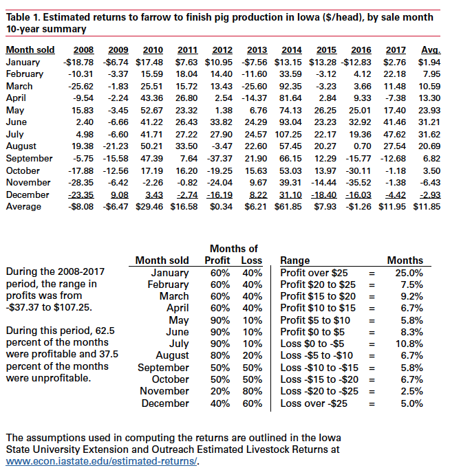

```{r setup, include=FALSE}
knitr::opts_chunk$set(echo=FALSE, fig.keep='high', out.width = '95%', fig.align = 'center', dev='cairo_pdf', warning = FALSE, message = FALSE)

#Load some packages
if (!require("pacman")) install.packages("pacman")
pacman::p_load(tidyverse)
pacman::p_load(lubridate)
pacman::p_load(readxl)
pacman::p_load(Quandl)
pacman::p_load(viridis)
pacman::p_load(Cairo)
options(kableExtra.latex.load_packages = TRUE)
pacman::p_load(kableExtra)
pacman::p_load(ggmap)
pacman::p_load(sp)
pacman::p_load(usmap)
pacman::p_load(maps)
pacman::p_load(magick)

#Authentification
#Quandl.api_key("2xcmYFJoJKuEDwawuV7J")

#Basic setup for figures
source("Figures/Graph parameters.r")

```

# Introduction

- The United States is the third largest producer of hogs in the world, behind China and the EU.
- The supply chain for hogs and pork operates differently than the supply chain for cattle and beef.
- Production cycles in hogs are shorter than in cattle but nonetheless important.
- Like cattle, the characteristics of hogs are difficult to observe on a live animal and the market has come up with solutions for the moral hazard problem it can create.
- I will begin with definitions, review some market data and finally turn to the economics of cattle marketing.

# Resources

-  [Information about livestock farming](https://www.extension.iastate.edu/agdm/ldfirst.html) from ISU extension.
-  [Hog markets](http://mindymallory.com/PriceAnalysis/hog-markets.html) from Mindy Mallory textbook.


# Definitions 

- Hog: Live animal, domesticated pig;
- Pork: Meat from hogs;
- Barrow: Neutered male hog;
- Boar: Uneutered male hog, usually kept for breeding;
- Feeder pig: Young hog, 6-8 weeks old and 40-50lbs in weight;
- Gilt: Female hog that has not yet had a litter;
- Sow: Female hog that has had a litter;
- Market hog: Adult hog for slaughter;
- Piglet: Baby pig;
- Weanling: Weaned pig, typically 2-3 weeks old and 10-15lbs in weight;
- Farrow: Birth of piglets;
- Parity: Number of farrowings or litters from a sow.

# Definitions 

- Farrow-to-finish: Production of hogs from birth (farrowing) to finishing (market hogs);
- Farrow-to-wean: Production of hogs from birth to weaning;
- Farrow-to-feeder: Production of hogs from farrow to feeder pigs;
- Wean-to-finish: Production of hogs from weaned pigs to finishing (market hogs);
- Feeder-to-finish: Female hog that has had a litter;

# Supply chain (example)

- Farrow-wean:
    - Sell weaned hogs (2-3 weeks old).
- Wean-to-finish:
    - Purchase weaned hogs;
    - Sell market hogs (24-29 weeks old depending on target weight).
- Packing/slaughter plant:
    - Buy market hogs;
    - Sell pork cuts.
- Retail/food service:
    - Buy pork cuts;
    - Sell beef to consumers.

# Commercial hog slaughter

```{r slaughter, out.width = '75%'}

if(Sys.time() - file.info("Data/7) Slaughter.xlsx")$mtime > months(1, abbreviate = FALSE)){
  download.file("https://www.ers.usda.gov/webdocs/DataFiles/90207/SlaughterCounts%20Pivot.xlsx", "Data/7) Slaughter.xlsx", method = "curl")  
}

dta <- read_excel("Data/7) Slaughter.xlsx", sheet = "Data sheet (machine readable)") %>%
  dplyr::filter(`Time period description` == "Month", Commodity == "Hogs") %>%
  dplyr::select(Date, Value) %>%
  mutate(Date = as.Date(Date), year = year(Date), Value = Value/1000) %>%
  group_by(year) %>%
  summarize(Value = sum(Value)) %>%
  dplyr::filter(year < year(Sys.time()))
  

plot_slaughter <- ggplot(dta, aes(x = year, y = Value)) +
  geom_line(color = "blue", size = 1) +
  ylab("Cattle slaughter (million head)") +
  scale_x_continuous(breaks = seq(1905, 2020, by = 10)) +
  theme_bw() + mytheme +
  theme(axis.title.x=element_blank(), axis.line = element_line(color='black'))

plot_slaughter

```
\scriptsize
Note: I suspect that the jump in the early 1940s is because of modification in the data recording method. Source: @USDA_dom.


# Pork production

```{r beef, out.width = '75%'}

if(Sys.time() - file.info("Data/7) Pork.xlsx")$mtime > months(1, abbreviate = FALSE)){
  download.file("https://www.ers.usda.gov/webdocs/DataFiles/90207/Pork%20Pivot.xlsx", "Data/7) Pork.xlsx", method = "curl")  
}

dta <- read_excel("Data/7) Pork.xlsx", sheet = "Data sheet (machine readable)") %>%
  dplyr::filter(`Statistic type` == "Total production",
                `Time period` == "Yr Jan-Dec",
                Commodity == "Pork") %>%
  dplyr::select(Year, Value)

plot_pork <- ggplot(dta, aes(x = Year, y = Value)) +
  geom_line(color = "blue", size = 1) +
  ylab("Pork production (million pound)") +
  scale_x_continuous(breaks = seq(1970, 2020, by = 5)) +
  theme_bw() + mytheme +
  theme(axis.title.x=element_blank(), axis.line = element_line(color='black'))

plot_pork

```
\scriptsize
Source: @USDA_dom.

# Average live and dressed cattle weight in federally inspected facility

```{r weight, out.width = '75%'}

if(Sys.time() - file.info("Data/7) Weight.xlsx")$mtime > months(1, abbreviate = FALSE)){
  download.file("https://www.ers.usda.gov/webdocs/DataFiles/90207/SlaughterWeights%20Pivot.xlsx", "Data/7) Weight.xlsx", method = "curl")
}

dta <- read_excel("Data/7) Weight.xlsx", sheet = "Data sheet (machine readable)") %>%
  dplyr::filter(`Time period description` == "Month", Commodity == "Hogs") %>%
  dplyr::select(Date, Value, Unit) %>%
  mutate(Date = as.Date(Date), 
         year = year(Date), 
         Unit = ifelse(Unit == "LB / HEAD, DRESSED BASIS", "Dressed", "Live")) %>% 
  group_by(Date, Unit) %>%
  summarize(Value = mean(Value))

plot_weight <- ggplot(dta, aes(x = Date, y = Value, color = Unit)) +
  geom_line(size = 1) +
  ylab("Weight in pound") +
  scale_color_manual(values = viridis(3)[c(1,2)]) +
  scale_x_date(breaks = seq(as.Date("1920-01-01"), as.Date("2020-12-31"), by="10 years"), date_labels = "%Y") +
  theme_bw() + mytheme +
  theme(axis.title.x=element_blank(), 
        axis.line = element_line(color='black'),
        legend.position = c(0.10, 0.90))

plot_weight

```
\scriptsize
Note: I suspect that the drop in carcass weight at the end of the 1970s is because of modifcation in the way to measure carcass weight. Source: @USDA_dom.

# Average carcass yield (live weight/dressed weight)

```{r yield, out.width = '75%'}

dta <- dta %>% 
  spread(Unit, Value) %>%
  mutate(yield = Dressed/Live)

plot_yield <- ggplot(dta, aes(x = Date, y = yield)) +
  geom_line(color = "blue", size = 1) +
  ylab("Yield") +
  scale_x_date(breaks = seq(as.Date("1920-01-01"), as.Date("2020-12-31"), by="10 years"), date_labels = "%Y") +
  theme_bw() + mytheme +
  theme(axis.title.x=element_blank(), 
        axis.line = element_line(color='black'),
        legend.position = c(0.10, 0.90))

plot_yield

```
\scriptsize
Note: I suspect that the drop in yield at the end of the 1970s is because of modifcation in the way to measure carcass weight. Source: @USDA_dom.

# Hog inventory by state (March 1, 2018)

```{r, out.width = '75%'}

# Read data
dta <- read_csv("Data/7) Hog inventory by state.csv")
dta <- dta %>%
  dplyr::filter(State != "ALASKA" & State != "HAWAII", Period == "FIRST OF MAR") %>%
  dplyr::select(State, Value) 

other <- dta[dta$State == "OTHER STATES", ]

dta <- dta %>%
  dplyr::filter(State != "OTHER STATES") %>%
  mutate(State = tolower(State))

# Get state boundaries
stateShapes <- map("state", plot = FALSE, fill = TRUE)
stateShapes <- fortify(stateShapes)

# Add missing states
dta2 <- cbind(State = unique(stateShapes$region)[!(unique(stateShapes$region) %in% c(dta$State, "district of columbia"))], Value = round(other$Value/(48 - nrow(dta)))) %>%
  as.tibble()

dta <- rbind(dta, dta2) %>%
  mutate(Value = as.numeric(Value), Value = 10*round(Value/min(Value)))

# Get number of point per state

for (i in 1:nrow(dta)){
  stateShapeFrame <- stateShapes[stateShapes$region == tolower(dta$State[i]), ]

  statePoly <- Polygons(lapply(split(stateShapeFrame[, c("long", "lat")], stateShapeFrame$group), Polygon), ID = "b")

  p_dta0 <- spsample(statePoly, n = dta$Value[i], "random") %>%
    as.data.frame() %>%
    rename(longitude = x, latitude = y) %>%
    mutate(state = tolower(dta$State[i]))

  if(!exists("p_dta")){p_dta <- p_dta0}
  if(exists("p_dta")){p_dta <- rbind(p_dta,p_dta0)}

}

us_state_map <- map_data('state')

d_inv <- ggplot() +
  geom_polygon(data=us_state_map, aes(x=long, y=lat, group = group), fill = NA, color = "black") +
  geom_point(data = p_dta, mapping = aes(longitude, latitude), shape=20, size = 0.25, alpha = 0.5, color = "blue") +
  coord_map( "polyconic" ) +
  theme_bw() +
  mytheme +
  theme(axis.line = element_blank(),
        axis.ticks = element_blank(),
        axis.text = element_blank(),
        axis.title = element_blank(),
        panel.grid = element_blank(),
        strip.background = element_blank(),
        panel.spacing.x=unit(-2, "lines"),
        panel.spacing.y=unit(0,"lines"),
        plot.margin=unit(c(0,-1,0,-1),"lines"),
        legend.text=element_text(size=8),
        legend.key.width = unit(0.4, "cm"),
        legend.key.height = unit(0.4, "cm"))
d_inv

```
\scriptsize
This is a density dot map. A dot does not represent the specific location of hogs. Rather, the number of dots within a state that represents the relative hog inventory by state. Source: @NASS.

# Hog inventory by state (March 1, 2018)

```{r, out.width = '75%'}

# Read data
dta <- read_csv("Data/7) Hog inventory by state.csv")
dta <- dta %>%
  dplyr::filter(State != "ALASKA" & State != "HAWAII", Period == "FIRST OF MAR") %>%
  dplyr::select(State, Value) 

dta <- dta %>%
  arrange(-Value) %>%
  dplyr::mutate(State = case_when(State == "IOWA" ~ "Iowa",
                                  State == "NORTH CAROLINA" ~ "North Carolina",
                                  State == "Minnesota" ~ "Minnesota",
                                  State == "ILLINOIS" ~ "Illinois",
                                  State == "INDIANA" ~ "Indiana",
                                  TRUE ~ "Other states")) %>%
  group_by(State) %>%
  summarize(Value = sum(Value)) %>%
  mutate(Value = round(Value/1000000, 1)) %>%
  rename(Inventory = Value)

kable(dta, booktabs = T) %>%
  kable_styling(latex_options = "striped") %>%
  footnote(general = "Inventory is measured in million heads")

```
Source: @NASS.

# Market hogs by state (March 1, 2018)

```{r, out.width = '75%'}

# Read data
dta <- read_csv("Data/7) Market hogs by state.csv")
dta <- dta %>%
  dplyr::select(State, Value) %>%
  dplyr::filter(State != "ALASKA" & State != "HAWAII" & State != "OTHER STATES") %>%
  mutate(State = tolower(State), Value = 10*round(Value/min(Value)))

# Get state boundaries
stateShapes <- map("state", plot = FALSE, fill = TRUE)
stateShapes <- fortify(stateShapes)

# Get random of point per state
rm(p_dta, p_dta0)

for (i in 1:nrow(dta)){
  stateShapeFrame <- stateShapes[stateShapes$region == dta$State[i], ]

  statePoly <- Polygons(lapply(split(stateShapeFrame[, c("long", "lat")], stateShapeFrame$group), Polygon), ID = "b")

  p_dta0 <- spsample(statePoly, n = dta$Value[i], "random") %>%
    as.data.frame() %>%
    rename(longitude = x, latitude = y) %>%
    mutate(state = tolower(dta$State[i]))

  if(!exists("p_dta")){p_dta <- p_dta0}
  if(exists("p_dta")){p_dta <- rbind(p_dta,p_dta0)}

}

d_feed <- ggplot() +
  geom_polygon(data=us_state_map, aes(x=long, y=lat, group = group), fill = NA, color = "black") +
  geom_point(data = p_dta, mapping = aes(longitude, latitude), shape=20, size = 0.25, alpha = 0.5, color = "blue") +
  coord_map( "polyconic" ) +
  theme_bw() +
  mytheme +
  theme(axis.line = element_blank(),
        axis.ticks = element_blank(),
        axis.text = element_blank(),
        axis.title = element_blank(),
        panel.grid = element_blank(),
        strip.background = element_blank(),
        panel.spacing.x=unit(-2, "lines"),
        panel.spacing.y=unit(0,"lines"),
        plot.margin=unit(c(0,-1,0,-1),"lines"),
        legend.text=element_text(size=8),
        legend.key.width = unit(0.4, "cm"),
        legend.key.height = unit(0.4, "cm"))

d_feed

```
\scriptsize
This is a density dot map. A dot does not represent the specific location of hogs. Rather, the number of dots within a state that represents the relative number of market hogs by state. Source: @NASS.

# Market hogs by state (March 1, 2018)

```{r, out.width = '75%'}

# Read data
dta <- read_csv("Data/7) Market hogs by state.csv")
dta <- dta %>%
  dplyr::select(State, Value) %>%
  dplyr::filter(State != "ALASKA" & State != "HAWAII" & State != "OTHER STATES")

dta <- dta %>%
  arrange(-Value) %>%
  dplyr::mutate(State = case_when(State == "IOWA" ~ "Iowa",
                                  State == "NORTH CAROLINA" ~ "North Carolina",
                                  State == "Minnesota" ~ "Minnesota",
                                  State == "ILLINOIS" ~ "Illinois",
                                  State == "INDIANA" ~ "Indiana",
                                  TRUE ~ "Other states")) %>%
  group_by(State) %>%
  summarize(Value = sum(Value)) %>%
  mutate(Value = round(Value/1000000, 1)) %>%
  rename(`Market hogs` = Value)

kable(dta, booktabs = T) %>%
  kable_styling(latex_options = c("striped")) %>%
  footnote(general = "The number of market hogs is measured in million heads")

```
Source: @NASS.

# Hog slaughter by state (2017)

```{r, out.width = '75%'}

# Read data
dta <- read_csv("Data/7) Hog slaughter by state.csv")
dta <- dta %>%
  dplyr::select(State, Value) %>%
  dplyr::filter(State != "ALASKA" & State != "HAWAII") %>%
  mutate(Value = str_replace_all(Value, ",", ""), 
         Value = as.numeric(Value))  %>%
  dplyr::filter(!is.na(Value)) %>% 
  mutate(Value = round(0.1*Value/min(Value))) %>%
  dplyr::filter(Value>0)

# Get state boundaries
stateShapes <- map("state", plot = FALSE, fill = TRUE)
stateShapes <- fortify(stateShapes)

# Get random of point per state
rm(p_dta, p_dta0)

for (i in 1:nrow(dta)){
  stateShapeFrame <- stateShapes[stateShapes$region == tolower(dta$State)[i], ]

  statePoly <- Polygons(lapply(split(stateShapeFrame[, c("long", "lat")], stateShapeFrame$group), Polygon), ID = "b")

  p_dta0 <- spsample(statePoly, n = dta$Value[i], "random") %>%
    as.data.frame() %>%
    rename(longitude = x, latitude = y) %>%
    mutate(state = tolower(dta$State[i]))

  if(!exists("p_dta")){p_dta <- p_dta0}
  if(exists("p_dta")){p_dta <- rbind(p_dta,p_dta0)}

}

d_slaughter <- ggplot() +
  geom_polygon(data=us_state_map, aes(x=long, y=lat, group = group), fill = NA, color = "black") +
  geom_point(data = p_dta, mapping = aes(longitude, latitude), shape=20, size = 0.25, alpha = 0.5, color = "blue") +
  coord_map( "polyconic" ) +
  theme_bw() +
  mytheme +
  theme(axis.line = element_blank(),
        axis.ticks = element_blank(),
        axis.text = element_blank(),
        axis.title = element_blank(),
        panel.grid = element_blank(),
        strip.background = element_blank(),
        panel.spacing.x=unit(-2, "lines"),
        panel.spacing.y=unit(0,"lines"),
        plot.margin=unit(c(0,-1,0,-1),"lines"),
        legend.text=element_text(size=8),
        legend.key.width = unit(0.4, "cm"),
        legend.key.height = unit(0.4, "cm"))


d_slaughter

```
\scriptsize
This is a density dot map. A dot does not represent the specific location of cattle. Rather, the number of dots within a state that represents the relative cattle slaughter by state. Source: @NASS.

# Hog slaughter by state (2017)

```{r, out.width = '75%'}

# Read data
dta <- read_csv("Data/7) Hog slaughter by state.csv")
dta <- dta %>%
  dplyr::select(State, Value) %>%
  dplyr::filter(State != "ALASKA" & State != "HAWAII" & State != "OTHER STATES")

dta <- dta %>%
  mutate(Value = str_replace_all(Value, ",", ""), 
         Value = as.numeric(Value)) %>%
  dplyr::filter(!is.na(Value)) %>%
  arrange(-Value) %>%
  dplyr::mutate(State = case_when(State == "IOWA" ~ "Iowa",
                                  State == "MISSOURI" ~ "Missouri",
                                  State == "Minnesota" ~ "Minnesota",
                                  State == "ILLINOIS" ~ "Illinois",
                                  State == "INDIANA" ~ "Indiana",
                                  TRUE ~ "Other states")) %>%
  group_by(State) %>%
  summarize(Value = sum(Value)) %>%
  mutate(Value = round(Value/1000000, 1)) %>%
  rename(`Hog slaughter` = Value)

kable(dta, booktabs = T) %>%
  kable_styling(latex_options = "striped") %>%
  footnote(general = "Hog slaughter is measured in million heads")

```
Source: @NASS.

# Annual imports of hogs

```{r, out.width = '75%'}

if(Sys.time() - file.info("Data/7) Hog trade.xls")$mtime > months(1, abbreviate = FALSE)){
  download.file("https://www.ers.usda.gov/webdocs/DataFiles/81475/Hog_YearlyFull.xls", "Data/7) Hog trade.xls", method = "curl")
}

dta <- read_excel("Data/7) Hog trade.xls", col_names = FALSE)

dta <- dta[c(2,41,45,48,51),] %>%
  dplyr::select(-X__1, -X__2)

colnames(dta) <- c("Category", dta[1,2:ncol(dta)])

dta <- dta[-1,]
dta$Category <- c("Less than 7kg", "Between 7 and 23kg", "Between 23 and 50kg", "Over 50kg")

dta <- dta %>% 
  gather(year, value,-Category) %>%
  mutate(year = as.numeric(year), value = as.numeric(value)/1000000) %>%
  replace_na(list(value = 0)) %>%
  dplyr::filter(year >= 2003)

plot_import <- ggplot(dta, aes(x = year, y = value, fill = Category)) +
  geom_area(position = "stack", alpha = 0.75) +
  geom_line(position = "stack", size = 0.5, color = "black") +
  scale_fill_manual(values = viridis(5)[c(1:4)]) +
  ylab("Imports of hogs (million heads)") +
  scale_x_continuous(breaks = seq(2002, 2018, by = 2), expand = c(0,0)) + 
  scale_y_continuous(expand = c(0,0)) +
  theme_bw() + mytheme +
  theme(axis.title.x=element_blank(), 
        axis.line = element_line(color='black'),
        legend.position = c(0.75, 0.9),
        legend.direction = "vertical")

plot_import

```
\scriptsize
Source: @usda_trade.

# Hog imports

- Virtually all hog imports are from Canada. 
- Most of the piglets (less than 7kg) come from Manitoba.
- Farrowing is more efficient (larger litter) in Canada presumably because of colder climate.
- The exchange rate also plays a role.

# Annual exports of hogs (all weights)

```{r, out.width = '75%'}
dta <- read_excel("Data/7) Hog trade.xls", col_names = FALSE)

dta <- dta[c(2,60:141),] %>%
  dplyr::select(-X__1, -X__2)

colnames(dta) <- c("Country", dta[1,2:ncol(dta)])

dta <- dta[-1,]
  
dta <- dta %>% 
  gather(year, value,-Country) %>%
  mutate(year = as.numeric(year), 
         value = as.numeric(value),
         Country = ifelse(Country %in% c("Mexico", "Canada", "South Korea", "China (Mainland)", "Japan"), Country, "Other countries")) %>%
  replace_na(list(value = 0)) %>%
  group_by(Country, year) %>%
  summarize(value = sum(value)) %>%
  ungroup() %>%
  dplyr::filter(year >= 2003)


plot_export <- ggplot(dta, aes(x = year, y = value,  fill = Country)) +
  geom_area(position = "stack", alpha = 0.75) +
  geom_line(position = "stack", size = 0.5, color = "black", alpha = 0.75) +
  scale_fill_viridis(discrete = TRUE) +
  ylab("Hog exports (head)") +
  scale_x_continuous(breaks = seq(2002, 2018, by = 2), expand = c(0,0)) + 
  scale_y_continuous(expand = c(0,0)) +
  theme_bw() + mytheme +
  theme(axis.title.x=element_blank(), 
        axis.line = element_line(color='black'),
        legend.position = c(0.75, 0.75),
        legend.direction = "vertical")

plot_export

```
\scriptsize
Source: @usda_trade.


# Pork imports (carcass weight, million pounds)

```{r, out.width = '75%'}
if(Sys.time() - file.info("Data/7) Pork trade.xls")$mtime > months(1, abbreviate = FALSE)){
  download.file("https://www.ers.usda.gov/webdocs/DataFiles/81475/Pork_YearlyFull.xls", "Data/7) Pork trade.xls", method = "curl")
}

dta <- read_excel("Data/7) Pork trade.xls", col_names = FALSE)

dta <- dta[c(2,3:81),] %>%
  dplyr::select(-X__1, -X__2)

colnames(dta) <- c("Country", dta[1,2:ncol(dta)])

dta <- dta[-1,]
  
dta <- dta %>% 
  gather(year, value,-Country) %>%
  mutate(Country = case_when(Country == "Canada" ~ "Canada",
                             Country == "Denmark" ~ "Denmark",
                             Country == "Poland" ~ "Poland",
                             Country == "Mexico" ~ "Mexico",
                             Country == "Netherlands" ~ "Netherlands",
                             TRUE ~ "Other countries"),
         value = as.numeric(value),
         year = as.numeric(year)) %>%
  replace_na(list(value = 0)) %>%
  group_by(Country, year) %>%
  summarize(value = sum(value)/1000) %>%
  dplyr::filter(year >= 2003)


pork_import <- ggplot(dta, aes(x = year, y = value, color = Country, fill = Country)) +
  geom_area(position = "stack", size = 1) +
  geom_line(position = "stack", size = 0.5, color = "black") +
  scale_color_viridis(discrete = TRUE) + 
  scale_fill_viridis(discrete = TRUE) +
  ylab("Imports of pork (carcass weight, million pounds)") +
  scale_x_continuous(breaks = seq(1990, 2015, by = 5), expand = c(0,0)) + 
  scale_y_continuous(expand = c(0,0)) +
  theme_bw() + mytheme +
  theme(axis.title.x=element_blank(), 
        axis.line = element_line(color='black'),
        legend.position = c(0.5, 0.9),
        legend.direction = "horizontal",
        legend.text=element_text(size=10))

pork_import

```
\scriptsize
Source: @USDA_dom.

# Pork exports (carcass weight, million pounds)

```{r, out.width = '75%'}

dta <- read_excel("Data/7) Pork trade.xls", col_names = FALSE)

dta <- dta[c(2,83:286),] %>%
  dplyr::select(-X__1, -X__2)

colnames(dta) <- c("Country", dta[1,2:ncol(dta)])

dta <- dta[-1,]
  
dta <- dta %>% 
  gather(year, value,-Country) %>%
  mutate(Country = case_when(Country == "Canada" ~ "Canada",
                             Country == "Mexico" ~ "Mexico",
                             Country == "Japan" ~ "Japan",
                             Country == "South Korea" ~ "South Korea",
                             Country == "China (Mainland)" ~ "China (Mainland)",
                             TRUE ~ "Other countries"),
         value = as.numeric(value)/1000,
         year = as.numeric(year)) %>%
  replace_na(list(value = 0)) %>%
  group_by(Country, year) %>%
  summarize(value = sum(value)) %>%
  ungroup() %>%
  dplyr::filter(year >= 2003)


pork_export <- ggplot(dta, aes(x = year, y = value, color = Country, fill = Country)) +
  geom_area(position = "stack") +
  geom_line(position = "stack", size = 0.5, color = "black") +
  scale_color_viridis(discrete = TRUE) +
  scale_fill_viridis(discrete = TRUE) +
  ylab("Exports of pork (carcass weight, million pounds)") +
  scale_x_continuous(breaks = seq(1990, 2015, by = 5), expand = c(0,0)) + 
  scale_y_continuous(expand = c(0,0)) +
  theme_bw() + mytheme +
  guides(col = guide_legend(ncol = 2)) +
  theme(axis.title.x=element_blank(), 
        axis.line = element_line(color='black'),
        legend.position = c(0.15, 0.9),
        legend.direction = "vertical",
        legend.text=element_text(size=10)) 

pork_export

```
\scriptsize
Source: @USDA_dom.

# Live hog price and pork cutout prices

```{r, out.width = '75%'}

if(Sys.time() - file.info("Data/7) Livestock prices.xlsx")$mtime > months(1, abbreviate = FALSE)){
  download.file("https://www.ers.usda.gov/webdocs/DataFiles/51875/Livestock%20and%20hay%20prices%20Pivot.xlsx", "Data/7) Livestock prices.xlsx", method = "curl")
}

if(Sys.time() - file.info("Data/7) Meat prices.xls")$mtime > months(1, abbreviate = FALSE)){
  download.file("https://www.ers.usda.gov/webdocs/DataFiles/51875/WholesalePrices.xls", "Data/7) Meat prices.xls", method = "curl")
}


dta <- read_excel("Data/7) Livestock prices.xlsx", sheet = "Data sheet (machine readable)")

dta <- dta %>%
  dplyr::filter(Commodity == "Hogs, Barrows and gilts") %>%
  dplyr::select(Date, Value) %>%
  mutate(Date = as.Date(Date),
         var = "Live hogs ($/cwt, live basis)") 

dta2 <- read_excel("Data/7) Meat prices.xls", sheet = "historical", skip = 4, col_names = FALSE) %>%
  dplyr::select(X__1, X__6) %>%
  rename(Date = X__1, Value = X__6) %>%
  mutate(Date = as.Date(Date),
         var = "Pork cutout ($/cwt)")

dta <- rbind(dta, dta2)

plot_price <- ggplot(dta, aes(x = Date, y = Value, color = var)) +
  geom_line(size = 1) +
  scale_color_manual(values = viridis(3)[c(1,2)]) +
  ylab("Price ($/cwt)") +
  scale_x_date(date_breaks = "1 year", date_labels = "%Y") +
  theme_bw() + mytheme +
  theme(axis.title.x=element_blank(), 
        axis.text.x=element_text(size = 10),
        axis.line = element_line(color='black'),
        legend.position = c(0.3, 0.9),
        legend.direction = "vertical")

plot_price


```
\scriptsize
Source: @USDA_dom.

# Beginning stocks of pork (Million lbs, CWE)

```{r, out.width = '75%'}

dta <- read_excel("Data/7) Pork.xlsx", sheet = "Data sheet (machine readable)")

dta <- dta %>%
  dplyr::filter(`Statistic type` == "Beginning stocks",
                `Time period` == "Yr Jan-Dec",
                Commodity == "Pork") %>%
  dplyr::select(Year, Value)
  
plot_stock <- ggplot(dta, aes(x = Year, y = Value)) +
  geom_line(color = "blue", size = 1) +
  ylab("Million lbs, CWE") +
  scale_x_continuous(breaks = seq(1970, 2020, by = 5)) +
  theme_bw() + mytheme +
  theme(axis.title.x=element_blank(), 
        axis.text.x=element_text(size = 10),
        axis.line = element_line(color='black'))

plot_stock

```
\scriptsize
Note: CWE means Carcass Weight Equivalent. Source: @USDA_dom.

# Hog cycles 

- Hog cycles are just like cattle cycles but they occur at a shorter interval because of a faster production dynamics in hogs.
- Hog cycles are expansion and contraction of hog inventories at regular intervals (see hog inventory figure below).
- A cycle lasts from three to five years. 
- Cycles occur because of biological nature of cattle production:
    - A sow can be bred for the first time at around 5 to 6 months old.
    - A sow will have its first litter about 113 days later (3 months, 3 weeks and 3 days).
    - It takes between 24 to 29 weeks to attain a target slaughter weight.

# Hog cycles

- Biological lags cause a delayed response between an increase in the price and an increase in production.
    - For example, if the price of feeder hogs increase, farrowing operations increase the size of their breeding herd.
    - During the time it takes to increase the breeding herd, the price continues to increase.
    - It takes about a year and a quarter from the time a farrowing operation decides to expand and the time its production actually increases.
    - Expansion continues until the prices for piglets, feeder pigs, market hogs and pork begins declining from the increased production.
    - Average parity per sow is about 5.5 litters. This means that a sow is culled at about 2.5 years old.
    - Producers reduce the size of their herd by not replacing all of their sows.
    - Hog production then declines and prices start increasing once again, re-starting the cycle.
- Cycles last 3 to 5 years.

# Hog cycles

- Cycles contribute to periods of prosperity followed by periods of losses to hog farmers.
-  See for example historial returns in the hog sector at <http://www2.econ.iastate.edu/estimated-returns/> or at 
<https://www.ers.usda.gov/data-products/commodity-costs-and-returns/commodity-costs-and-returns/>


# US December hog inventory

```{r, out.width = '75%'}

#Data are from NASS QuickStats

dta = read_csv("Data/7) Hog inventory.csv")
dta <- dta %>% 
  dplyr::filter(Period == "FIRST OF DEC") %>% 
  dplyr::select(Year, Value) %>% 
  mutate(Value = Value / 1000000)

plot_inventory <- ggplot(dta, aes(x = Year, y = Value)) +
  geom_line(color = "blue", size = 1) +
  ylab("January inventory (million head)") +
  scale_x_continuous(breaks = seq(1870, 2020, by = 10)) +
  theme_bw() + mytheme +
  theme(axis.title.x=element_blank(), axis.line = element_line(color='black'))

plot_inventory

```
\scriptsize
Note: I suspect that the shocks in the 1930s and 1940s have to do with how the data were collected. Source: @NASS.

# Return to a farrow-to-finish operation in Iowa ($/head)


```{r, echo=FALSE, out.width = '75%'}

if(Sys.time() - file.info("Figures/7) Return farrow to finish.png")$mtime > months(1, abbreviate = FALSE)){
  fig <- image_read("https://www.extension.iastate.edu/agdm/livestock/html/images/b1-31tbl1.gif")
  image_write(fig, path = "Figures/7) Return farrow to finish.png", format = "png")
}


```
\scriptsize
Note: If considering value of production less total costs the returns are negative for several years. Source: @USDAreturn.

# Marketing methods for hogs

- The same marketing methods for cattle are used in the hog industry.
- However, an important difference is that in addition to the traditional marketing methods, a major part of hog production is under contracts.
- Vertical integration means that *integrators*, or *contractors*, contract production for their hogs to independent growers or are directly involved in upstream production stages.
- Integrators are packing plants.
- *Full integration* means that a packing plants own facilities for growing hogs and thus control the entire supply chain.
- It is not possible to tell how much of the hog production is under vertical control.
- It is also very difficult to tell whether there is a trend toward more vertical integration and more full integration.
- See some explanations at this link: <http://porkgateway.org/resource/producing-and-marketing-hogs-under-contract/>.

# Why are there contracts in the hog industry?

- There are contracts in the grain and cattle industry.
    - The objective of these contracts is usually to manage price risk.
    - The contracts are typically for a relatively short period of time (a few months).
- Contracts in hog and poultry, as well as for specialty crops, are different:
    - They address issues regarding price risk.
    - They also include provisions regarding the characteristics of a product and farming methods.
    - The contracts cover longer time period (years).
- The extent of vertical integration depends on transaction costs and asset specificity.

# Transaction costs and asset specificity

- Some characteristics of a product are difficult (i.e. costly) to observe.
    - For example, a packer could do extensive tests for antibiotics or other meat quality traits on every carcass but this would be very costly.
    - Observing/testing the quality of a product is an example of transaction cost that firms might have to incur.
    - Contract can specify practices that insure the presence or absence of certain characteristics, hence eliminating certain transaction costs.
- A farm would not invest into assets specific to meet the need of a packer unless it is guaranteed that it can have a return on that asset.
    - A contract can provide a long term incentive to invest in some specific assets.

# Transaction costs and asset specificity {.allowframebreaks}

- The figure below shows the relationship between vertical integration, transaction costs and asset specificity.
    - The horizontal axis is the degree of asset specificity.
    - The vertical axis is the transaction costs for a product, which may include testing.
- The three cost curves show three types of transactions:
    1. Spot market;
    2. Contract;
    3. Firm, i.e. full integration.
- If transaction costs are low and assets are not specific, the spot market minimizes costs.
    - This is the example for corn.
- As transaction costs increase and assets are more specific, then contracts minimize costs.
    - This is the example for a major part of the hog production.
- In the case where transaction costs are high and assets are very specific, then full integration becomes the cost minimizing method.
    - This is the example of the poultry industry where some packers control the supply chain from feeds up to packing.

# Transaction costs and asset specificity

```{r, echo=FALSE, out.width = '75%'}
knitr::include_graphics("Figures/Contract_cost.png")
```
Note: On the horizontal axis is the degree of asset specificity. Source: @CrespiSaitone2018.

# Vertical integration in the hog industry

- The hog industry uses the spot market, contracts and full integration:
    - Spot market is not very common anymore.
    - Most of the production of hogs is under contract.
    - There is a good share of the production that is under full integration but that is difficult to evaluate how much. 
- That is, most of the hog production is under some form of vertical integration (contracts are full integration).

# Advantages to vertical integration in the hog industry

- Vertical integration minimizes transaction costs and incentivizes investments in specific assets.
- Some related advantages to vertical integration in the hog industry.
    - Smooths out production cycles, especially seasonal production cycles;
    - This allows to maintain a more uniform production volume throughout the year, reducing packing costs;
    - Reduces price risks;
    - Better control of genetics;
    - Allows for a better control of hog characteristics (e.g. size), reducing packing costs;
    - Facilitates widespread adoption of latest practices and technologies, hence reducing production costs.

# Disadvantages to vertical integration in the hog industry

- There are some disadvantages to vertical integration in the hog industry.
    - Growers partly loose control of their operation;
    - Growers may have limited ability to negotiate the terms of production contracts;
    - Growers retains production risk.
    - There might be a hold up problem where growers invest in specific assets and at the end of a contract they do not have any other option than to contract again with the same integrator.
    
# Vertical integration

- For vertical integration to work, it requires that both the integrators and the growers gain from it.
- Intergators must offer contracts such that some growers will be willing to accept.
- Price for hogs under contract are either negotiated (fixed base price) or determined by formula.
    - Some contracts will also specify premia for grade and yields.
- Contracts are incomplete, meaning that they cannot account for every possible contingency.
    - This became evident with the outbreak of PEDv recently.
    - Producers who received sick pig could not meet production targets.
    - This became an important legal issue.

# Price of weaned and feeder hogs

- Prices for hogs are determined at the intersection of demand and supply.
- An increase in the costs to farrow-to-wean or farrow-to-feeder reduces the supply of weaned pig and feeder pigs.
    - For example, the outbreak of Porcine Epidemic Diarrhea Virus (PEDV) in 2014 reduced yields in farrowing effectively increasing production costs.
    - This shifted the supply of weaned pigs and feeder pigs to the left.
- Many factors affect the demand for weaned pigs and feeder pigs:
    - Feeding costs (e.g. cost and other feeds);
    - Costs at packing plants (e.g. labor costs);
    - Domestic consumer demand (e.g. income, price of substitute products, irrational fear);
    - International consumer demand (e.g. trade agreements, competition from other countries, exchange rate, tariffs).

# Price of slaughter hogs

- The price of slaughter hogs is determined at the intersection of demand and supply.
- Costs of finishing hogs affect the supply of slaughter hogs:
    - Includes the cost of younger pigs (weanlings, feeders);
    - Cost of feed (e.g. corn);
    - Because PEDV shifted the supply of weanlings and feeders, it also shifted to the left the supply of market hogs.
- Many factors affect the demand for market hogs:
    - Costs at packing plants (e.g. labor costs);
    - Domestic consumer demand (e.g. income, price of substitute products);
    - International consumer demand (e.g. trade agreements, competition from other countries, exchange rate, tariffs).
- Characteristics of a pigs (e.g. breed, weight, color) explain difference in prices across pigs.

# Hogs prices

- Throughout the supply chain, the characteristics of hogs affect their prices.
- Quality is difficult to observe but hogs tend to be more homogenous than cattle.
    - There are more breed variety in cattle (southern versus northern breeds, dairy).
- The methods to price hogs in direct sales or contracts are very similar to those for direct sales for cattle.
    - For that reason they are not covered here.
- The number of hogs sold live is small.
- There are hogs that are sold between packers:
    - A packer might have more hog produced in an area than it can processed nearby;
    - Temporary slow down in packing operations.

# Negotiated versus formula - producer sold, carcass basis

```{r, out.width = '75%'}
#You might need a password to download this file

if(Sys.time() - file.info("Data/7) Prior day hog slaughter.xls")$mtime > months(1, abbreviate = FALSE)){
  download.file("http://lmic.info/sites/default/files/lmic_private_fs/memberonlyfiles/spreadsheets/hogs/PriorDaySlaughterNational.xls", "Data/7) Prior day hog slaughter.xls", method = "curl")
}

dta <- read_excel("Data/7) Prior day hog slaughter.xls", sheet = "Monthly", skip = 5, col_names = FALSE) %>%
  dplyr::select(X__1, X__2, X__14, X__26, X__38) %>%
  rename(date = X__1, Negotiated = X__2, Other = X__14, Market = X__26, `Other agreement` = X__38) %>%
  mutate(Formula = Other + Market, date = as.Date(date)) %>%
  dplyr::select(date, Negotiated, Formula, `Other agreement`) %>%
  gather(var, value, -date)

plot_cat <- ggplot(dta, aes(x = date, y = value, fill = var)) +
  geom_area(position='fill', alpha = 0.75) +
  ylab("Share") +
  scale_x_date(date_breaks = "2 years", date_labels = "%Y", expand = c(0,0)) +
  scale_y_continuous(expand = c(0,0)) +
  scale_fill_manual(values = viridis(4)[c(1,2,3)]) + 
  theme_bw() + mytheme +
  theme(axis.title.x=element_blank(), 
        axis.text.x=element_text(size = 10),
        axis.line = element_line(color='black'))

plot_cat

```

# Carcass grading

- Packers use different matrices to reward the characteristics that they find desirable.
    - Packers offer different pork products to consumers and hence they look into different quality attributes into hog carcasses.
- The characteristics considered include:
    - Backfat thickness;
    - Loineye area;
    - Loin depth.
- The net price is calculated from a base price to which are added discounts and premia depending on the characteristics of a carcass.

# What are the discounts and premia

- The USDA reports price ranges based on measured backfat thickness, loineye area and loin depth.
- This information is available in report `lm_hg200`: <https://www.ams.usda.gov/mnreports/lm_hg200.txt>.

# Example matrix from USDA report `lm_hg200` 

- Below is an example of the range of prices paid for negotiate hog prices for given backfat thickness, loineye area and loin depth.

\verbfilenobox[\tiny]{"Data/7) lm_hg200.txt"}

# Base price and net price - producer sold

```{r, out.width = '75%'}

dta <- read_excel("Data/7) Prior day hog slaughter.xls", sheet = "Producer", skip = 5, col_names = FALSE, col_type = c("date",rep("numeric", 72))) %>%
  dplyr::select(X__1, X__63, X__64) %>%
  rename(date = X__1, `Base price` = X__63, `Net price` = X__64) %>%
  mutate(date = as.Date(date)) %>%
  gather(var, value, - date)

plot_price <- ggplot(dta, aes(x = date, y = value, color = var)) +
  geom_line() +
  ylab("Price ($/lb)") +
  scale_x_date(date_breaks = "2 years", date_labels = "%Y", expand = c(0,0)) +
  scale_color_manual(values = viridis(3)[c(1,2)]) + 
  theme_bw() + mytheme +
  theme(axis.title.x=element_blank(), 
        axis.text.x=element_text(size = 10),
        axis.line = element_line(color='black'),
        legend.position = c(0.15, 0.75))

plot_price

```


# Mandatory price reporting (MPR)

- MPR also applies to the hog industry.


# References


