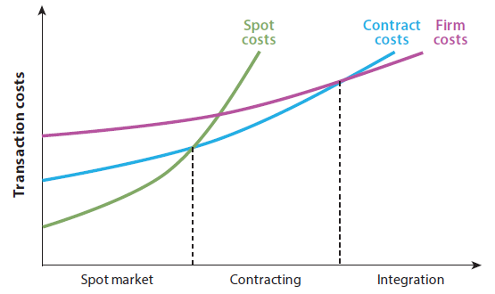

```{r setup, include=FALSE}
knitr::opts_chunk$set(echo=FALSE, fig.keep='high', out.width = '95%', fig.align = 'center', dev='cairo_pdf', warning = FALSE, message = FALSE)

#Load some packages
library(pacman)
pacman::p_load(tidyverse)
pacman::p_load(lubridate)
pacman::p_load(readxl)
pacman::p_load(xlsx)
pacman::p_load(Quandl)
pacman::p_load(viridis)
pacman::p_load(Cairo)
options(kableExtra.latex.load_packages = TRUE)
pacman::p_load(kableExtra)
pacman::p_load(ggmap)
pacman::p_load(sp)
pacman::p_load(usmap)
pacman::p_load(maps)
pacman::p_load(magick)
pacman::p_load(pingr)

#Turn off warnings
options(warn=-1)

#Authentification
#Quandl.api_key("2xcmYFJoJKuEDwawuV7J")

#Basic setup for figures
source("Figures/Graph parameters.r")

```

# Introduction

- The United States is the largest producer of poultry and the second largest exporter of poultry.
- The 2012 Census of Agriculture reports that there are 233,770 poultry farms in the United States.
- The U.S. poultry industry produced in 2014:
    - 8.54 billion broilers;
    - 99.8 billion eggs;
    - 238 million turkeys.
- Sales of chickens were worth \$48.3 billion in 2014.
- The poultry industry is very much vertically integrated.
- Production cycles in poultry are very short and essentially inexistent. However, seasonality used to be a problem.

# Introduction

- We will focus on the chicken industry and briefly look into the egg industry.
- We will begin with definitions, review some market data and look into how contracts in the poultry industry work.

# Resources

- [Fact Sheet about the US poultry industry.](https://www.usda.gov/sites/default/files/documents/nass-poultry-stats-factsheet.pdf)
- [Egg Industry Center](https://www.eggindustrycenter.org/) at Iowa State University.
- [Poultry & Eggs](https://www.ers.usda.gov/topics/animal-products/poultry-eggs/) from the Economic Research Service at the USDA.


# Definitions 

- Poultry: Domestic fowl, includes chicken and turkey.
- Chicken: A domestic fowl.
- Turkey: A domestic fowl, bigger than a chicken. 
- Hen: A female chicken or turkey.
- Rooster: A male chicken.
- Gobbler: A male turkey.
- Pullet: A young hen.
- Chick: A young chicken.
- Broiler: Chicken raised for meat production.
- Table eggs: Eggs grown for sale to consumers. 
- Breaker eggs: Eggs grown for breaking and used in the food industry. They can be sold liquid, dried or frozen. 

# Supply chain

- Poultry industry:
    - Primary breefer farms: Produce fertilized eggs that are hatched to become breeders.
    - Breeder farms: Raise hens and roosters to producer fertilized eggs.
    - Hatcheries: Hatch fertilized eggs into chicks. 
    - Chicken farms: Grow chicks into broilers.
    - Poultry processing plant: Take live bird and turn them into meat.

# Supply chain

- Egg industry:
    - Breeder farms raise hens and roosters to produce fertilized eggs.
    - Hatcheries: Hatch the eggs and select the hens.
    - Egg farms: Harvest eggs from egg-laying hens.


# Annual commercial broiler chicken slaughter
```{r slaughter, out.width = '75%'}

if(Sys.time() - file.info("Data/7) Slaughter.xlsx")$mtime > months(1, abbreviate = FALSE) & pingr::is_online()){
  download.file("https://www.ers.usda.gov/webdocs/DataFiles/90207/SlaughterCounts%20Pivot.xlsx", "Data/7) Slaughter.xlsx", method = "curl")  
}

dta <- read_excel("Data/7) Slaughter.xlsx", sheet = "Data sheet (machine readable)") %>%
  dplyr::filter(`Time period description` == "Month", Commodity == "Chickens, Broilers") %>%
  dplyr::select(Date, Value) %>%
  mutate(Date = as.Date(Date), year = year(Date), Value = Value/1000) %>%
  group_by(year) %>%
  summarize(Value = sum(Value)) %>%
  dplyr::filter(year < year(Sys.time()))
  
plot_slaughter <- ggplot(dta, aes(x = year, y = Value)) +
  geom_line(color = "blue", size = 1) +
  ylab("Broiler chicken (million head)") +
  scale_x_continuous(breaks = seq(1960, 2020, by=5), minor_breaks = seq(1960, 2020, by=1), expand = c(0,0)) +
  theme_bw() + mytheme +
  theme(axis.title.x=element_blank(), axis.line = element_line(color='black'))

plot_slaughter

```
\scriptsize
Data source: @USDA_dom.


# Annual poultry production

```{r beef, out.width = '75%'}

if(Sys.time() - file.info("Data/8) Poultry.xlsx")$mtime > months(1, abbreviate = FALSE) & pingr::is_online()){
  download.file("https://www.ers.usda.gov/webdocs/DataFiles/90207/Red%20Meat%20Poultry%20Production%20Pivot.xlsx", "Data/8) Poultry.xlsx", method = "curl") 
}

dta <- read_excel("Data/8) Poultry.xlsx", sheet = "Data sheet (machine readable)") %>%
  dplyr::filter(`Time description` == "Annual",
                Commodity == "Total poultry") %>%
  dplyr::select(Year, Value) %>%
  dplyr::filter(Year < year(Sys.time()))

plot_poultry <- ggplot(dta, aes(x = Year, y = Value)) +
  geom_line(color = "blue", size = 1) +
  ylab("Poultry production (million pounds)") +
  scale_x_continuous(breaks = seq(1960, 2020, by=5), minor_breaks = seq(1960, 2020, by=1), expand = c(0,0)) +
  theme_bw() + mytheme +
  theme(axis.title.x=element_blank(), axis.line = element_line(color='black'))

plot_poultry

```
\scriptsize
Note: Total poultry includes chicken and turkey. Data source: @USDA_dom.


# Table eggs and egg breakers annual production

```{r weight, out.width = '75%'}

if(Sys.time() - file.info("Data/8) Egg production.xlsx")$mtime > months(1, abbreviate = FALSE) & pingr::is_online()){
  download.file("https://www.ers.usda.gov/webdocs/DataFiles/90207/Eggs%20and%20Egg%20Products%20Pivot.xlsx", "Data/8) Egg production.xlsx", method = "curl")
}

dta <- read_excel("Data/8) Egg production.xlsx", sheet = "Data sheet (machine readable)") %>%
  dplyr::filter(`Time period` == "Yr Jan-Dec", 
                Commodity == "Eggs and egg products",
                `Statistic type` %in% c("Federally inspected eggs broken", "Table production") ) %>%
  rename(var = `Statistic type`) %>%
  dplyr::select(Year, var, Value) %>%
  mutate(var = ifelse(var == "Table production", "Table eggs", "Egg breakers")) 

plot_eggs <- ggplot(dta, aes(x = Year, y = Value, color = var)) +
  geom_line(size = 1) +
  ylab("Million dozen, shell-egg equivalent") +
  scale_color_manual(values = viridis(3)[c(1,2)]) +
  scale_x_continuous(breaks = seq(2000, 2018, by = 2), minor_breaks = seq(2000, 2018, by = 1), expand = c(0,0)) + 
  theme_bw() + mytheme +
  theme(axis.title.x=element_blank(), 
        axis.line = element_line(color='black'),
        legend.position = c(0.10, 0.90))

plot_eggs

```
\scriptsize
Data source: @USDA_dom.

# Broilers weight (live basis)

```{r yield, out.width = '75%'}

if(Sys.time() - file.info("Data/8) Poultry weight.xlsx")$mtime > months(1, abbreviate = FALSE) & pingr::is_online()){
  download.file("https://www.ers.usda.gov/webdocs/DataFiles/90207/SlaughterWeights%20Pivot.xlsx", "Data/8) Poultry weight.xlsx", method = "curl")
}

dta <- read_excel("Data/8) Poultry weight.xlsx", sheet = "Data sheet (machine readable)") %>%
  dplyr::filter(`Time period description` == "CalendarYear", 
                Commodity == "Chickens, Broilers") %>%
  dplyr::select(Year, Value) 

plot_weight <- ggplot(dta, aes(x = Year, y = Value)) +
  geom_line(size = 1) +
  ylab("Lb per head, live basis") +
  scale_x_continuous(breaks = seq(1960, 2020, by=5), minor_breaks = seq(1960, 2020, by=1), expand = c(0,0)) +
  theme_bw() + mytheme +
  theme(axis.title.x=element_blank(), 
        axis.line = element_line(color='black'),
        legend.position = c(0.10, 0.90))

plot_weight

```
\scriptsize
Data source: @USDA_dom.

# Chicken broiler production by state (2017)

```{r, out.width = '75%'}

# Read data
dta <- read_csv("Data/8) Chicken production by state.csv")
dta <- dta %>%
  dplyr::filter(State != "ALASKA" & State != "HAWAII") %>%
  dplyr::select(State, Value) %>%
  mutate(State = stringr::str_to_title(State),
         State = ifelse(State %in% c("Alabama", "Arkansas", "Georgia", "Mississippi"), State, "Other states"),
         Value = Value/1000000) %>%
  group_by(State) %>%
  summarize(Value = sum(Value)) %>%
  ungroup()

kable(dta, booktabs = T) %>%
  kable_styling(latex_options = "striped") %>%
  footnote(general = "Million heads")

```
\scriptsize
Data source: @NASS.

# Operation with broilers inventory by county (2012 census of agriculture)

```{r, out.width = '75%'}

# Read data
dta <- read_csv("Data/8) Broiler inventory by county.csv")
dta <- dta %>%
  dplyr::filter(State != "ALASKA" & State != "HAWAII") %>%
  dplyr::select(State, Value, `Ag District`, County) %>%
  mutate(Value = str_replace_all(Value, ",", ""), 
         Value = round(as.numeric(Value)/10),
         state_county = paste(tolower(State), tolower(County), sep = "_"),
         state_county = str_replace(state_county, "_saint", "_st"),
         state_county = str_replace(state_county, "_st[.]", "_st"),
         state_county = str_replace(state_county, "leflore", "le flore"),
         state_county = str_replace(state_county, "suffolk city", "suffolk")) %>%
  dplyr::filter(!is.na(Value), Value>0)

# Get county and state boundaries
countyShapes <- map("county", plot = FALSE, fill = TRUE)
countyShapes <- fortify(countyShapes)
countyShapes <- countyShapes %>%
  mutate(state_county = paste(tolower(region), tolower(subregion), sep = "_"))

stateShapes <- map("state", plot = FALSE, fill = TRUE)
stateShapes <- fortify(stateShapes)

# Get number of point per county
rm(p_dta, p_dta0)
for (i in 1:nrow(dta)){
  countyShapeFrame <- countyShapes[countyShapes$state_county == dta$state_county[i], ]

  countyPoly <- Polygons(lapply(split(countyShapeFrame[, c("long", "lat")], countyShapeFrame$group), Polygon), ID = "b")

  p_dta0 <- spsample(countyPoly, n = dta$Value[i], "random") %>%
    as.data.frame() %>%
    rename(longitude = x, latitude = y) %>%
    mutate(state_county = dta$state_county[i])

  if(!exists("p_dta")){p_dta <- p_dta0}
  if(exists("p_dta")){p_dta <- rbind(p_dta,p_dta0)}

}

us_county_map <- map_data('county')
us_state_map <- map_data('state')

d_inv <- ggplot() +
  geom_polygon(data=us_county_map, aes(x=long, y=lat, group = group), fill = NA, color = "gray") +
  geom_point(data = p_dta, mapping = aes(longitude, latitude), shape=20, size = 0.25, alpha = 0.5, color = "blue") +
  geom_polygon(data=us_state_map, aes(x=long, y=lat, group = group), fill = NA, color = "black") +
  coord_map( "polyconic" ) +
  theme_bw() +
  mytheme +
  theme(axis.line = element_blank(),
        axis.ticks = element_blank(),
        axis.text = element_blank(),
        axis.title = element_blank(),
        panel.grid = element_blank(),
        strip.background = element_blank(),
        panel.spacing.x=unit(-2, "lines"),
        panel.spacing.y=unit(0,"lines"),
        plot.margin=unit(c(0,-1,0,-1),"lines"),
        legend.text=element_text(size=8),
        legend.key.width = unit(0.4, "cm"),
        legend.key.height = unit(0.4, "cm"))
d_inv

```
\scriptsize
This is a density dot map where each dot represents about 10 operations, randomly located within a county. Data source: @NASS.


# Egg farms with production contracts (2012 census of agriculture)

```{r, out.width = '75%'}

# Read data
dta <- read_csv("Data/8) Egg operations with contracts.csv")
dta <- dta %>%
  dplyr::filter(State != "ALASKA" & State != "HAWAII") %>%
  dplyr::select(State, Value, `Ag District`, County) %>%
  mutate(Value = str_replace_all(Value, ",", ""), 
         Value = round(as.numeric(Value)),
         state_county = paste(tolower(State), tolower(County), sep = "_"),
         state_county = str_replace(state_county, "_saint", "_st"),
         state_county = str_replace(state_county, "_st[.]", "_st"),
         state_county = str_replace(state_county, "leflore", "le flore"),
         state_county = str_replace(state_county, "suffolk city", "suffolk"),
         state_county = str_replace(state_county, "o brien", "obrien")) %>%
  dplyr::filter(!is.na(Value), Value>0)

# Get county and state boundaries
countyShapes <- map("county", plot = FALSE, fill = TRUE)
countyShapes <- fortify(countyShapes)
countyShapes <- countyShapes %>%
  mutate(state_county = paste(tolower(region), tolower(subregion), sep = "_"))

stateShapes <- map("state", plot = FALSE, fill = TRUE)
stateShapes <- fortify(stateShapes)

# Get number of point per county
rm(p_dta, p_dta0)

for (i in 1:nrow(dta)){
  countyShapeFrame <- countyShapes[countyShapes$state_county == dta$state_county[i], ]

  countyPoly <- Polygons(lapply(split(countyShapeFrame[, c("long", "lat")], countyShapeFrame$group), Polygon), ID = "b")

  p_dta0 <- spsample(countyPoly, n = dta$Value[i], "random") %>%
    as.data.frame() %>%
    rename(longitude = x, latitude = y) %>%
    mutate(state_county = dta$state_county[i])

  if(!exists("p_dta")){p_dta <- p_dta0}
  if(exists("p_dta")){p_dta <- rbind(p_dta,p_dta0)}

}

us_county_map <- map_data('county')
us_state_map <- map_data('state')

d_inv <- ggplot() +
  geom_polygon(data=us_county_map, aes(x=long, y=lat, group = group), fill = NA, color = "gray") +
  geom_point(data = p_dta, mapping = aes(longitude, latitude), shape=20, size = 0.25, alpha = 0.5, color = "blue") +
  geom_polygon(data=us_state_map, aes(x=long, y=lat, group = group), fill = NA, color = "black") +
  coord_map( "polyconic" ) +
  theme_bw() +
  mytheme +
  theme(axis.line = element_blank(),
        axis.ticks = element_blank(),
        axis.text = element_blank(),
        axis.title = element_blank(),
        panel.grid = element_blank(),
        strip.background = element_blank(),
        panel.spacing.x=unit(-2, "lines"),
        panel.spacing.y=unit(0,"lines"),
        plot.margin=unit(c(0,-1,0,-1),"lines"),
        legend.text=element_text(size=8),
        legend.key.width = unit(0.4, "cm"),
        legend.key.height = unit(0.4, "cm"))
d_inv

```
\scriptsize
This is a density dot map where each dot represents about 1 operation, randomly located within a county. Data source: @NASS.

# Farms with more than 10,000 layers (2012 census of agriculture)

```{r, echo=FALSE, out.width = '75%'}

# Read data
dta <- read_csv("Data/8) Layer inventory.csv")
dta <- dta %>%
  dplyr::filter(State != "ALASKA" & State != "HAWAII",
                `Domain Category` == "INVENTORY: (10,000 TO 19,999 HEAD)") %>%
  dplyr::select(State, Value, `Ag District`, County) %>%
  mutate(Value = str_replace_all(Value, ",", ""), 
         Value = round(as.numeric(Value)),
         state_county = paste(tolower(State), tolower(County), sep = "_"),
         state_county = str_replace(state_county, "_saint", "_st"),
         state_county = str_replace(state_county, "_st[.]", "_st"),
         state_county = str_replace(state_county, "leflore", "le flore"),
         state_county = str_replace(state_county, "suffolk city", "suffolk"),
         state_county = str_replace(state_county, "o brien", "obrien"),
         state_county = str_replace(state_county, "virginia beach city", "virginia beach")) %>%
  dplyr::filter(!is.na(Value), Value>0, 
                state_county != "south dakota_oglala lakota",
                state_county != "virginia_chesapeake city")

# Get county and state boundaries
countyShapes <- map("county", plot = FALSE, fill = TRUE)
countyShapes <- fortify(countyShapes)
countyShapes <- countyShapes %>%
  mutate(state_county = paste(tolower(region), tolower(subregion), sep = "_"))

stateShapes <- map("state", plot = FALSE, fill = TRUE)
stateShapes <- fortify(stateShapes)

# Get number of point per county
rm(p_dta, p_dta0)

for (i in 1:nrow(dta)){
  countyShapeFrame <- countyShapes[countyShapes$state_county == dta$state_county[i], ]

  countyPoly <- Polygons(lapply(split(countyShapeFrame[, c("long", "lat")], countyShapeFrame$group), Polygon), ID = "b")

  p_dta0 <- spsample(countyPoly, n = dta$Value[i], "random") %>%
    as.data.frame() %>%
    rename(longitude = x, latitude = y) %>%
    mutate(state_county = dta$state_county[i])

  if(!exists("p_dta")){p_dta <- p_dta0}
  if(exists("p_dta")){p_dta <- rbind(p_dta,p_dta0)}

}

us_county_map <- map_data('county')
us_state_map <- map_data('state')

d_inv <- ggplot() +
  geom_polygon(data=us_county_map, aes(x=long, y=lat, group = group), fill = NA, color = "gray") +
  geom_point(data = p_dta, mapping = aes(longitude, latitude), shape=20, size = 0.25, alpha = 0.5, color = "blue") +
  geom_polygon(data=us_state_map, aes(x=long, y=lat, group = group), fill = NA, color = "black") +
  coord_map( "polyconic" ) +
  theme_bw() +
  mytheme +
  theme(axis.line = element_blank(),
        axis.ticks = element_blank(),
        axis.text = element_blank(),
        axis.title = element_blank(),
        panel.grid = element_blank(),
        strip.background = element_blank(),
        panel.spacing.x=unit(-2, "lines"),
        panel.spacing.y=unit(0,"lines"),
        plot.margin=unit(c(0,-1,0,-1),"lines"),
        legend.text=element_text(size=8),
        legend.key.width = unit(0.4, "cm"),
        legend.key.height = unit(0.4, "cm"))

d_inv

```
\scriptsize
This is a density dot map where each dot represents about 1 operation, randomly located within a county. Data source: @NASS.


# Annual broiler imports

```{r, out.width = '75%'}

if(Sys.time() - file.info("Data/8) Chicken and egg trade.xls")$mtime > months(1, abbreviate = FALSE) & pingr::is_online()){
  download.file("https://www.ers.usda.gov/webdocs/DataFiles/81475/BroilerTurkey_YearlyFull.xls", "Data/8) Chicken and egg trade.xls", method = "curl")
}

dta <- read_excel("Data/8) Chicken and egg trade.xls", col_names = FALSE, sheet = 1, skip = 1)

dta <- dta[c(1,2:11),] %>%
  dplyr::select(-X__1, -X__2)

colnames(dta) <- c("country", dta[1,2:ncol(dta)])
dta <- dta[-1,]

dta <- dta %>% 
  gather(year, value,-country) %>%
  mutate(year = as.numeric(year), value = as.numeric(value)/1000) %>%
  replace_na(list(value = 0)) %>%
  dplyr::filter(year >= 2000)

dta  <- dta %>%
  mutate(country = case_when(country == "Canada"  ~ "Canada",
                             country == "Chile"  ~ "Chile",
                             TRUE ~ "Other countries")) %>%
  group_by(country, year) %>%
  summarize(value = sum(value)) %>%
  ungroup()

plot_import <- ggplot(dta, aes(x = year, y = value, fill = country)) +
  geom_area(position = "stack", alpha = 0.75) +
  geom_line(position = "stack", size = 0.5, color = "black") +
  scale_fill_manual(values = viridis(4)[c(1:3)]) +
  ylab("Imports of broilers (million pounds)") +
  scale_x_continuous(breaks = seq(2000, 2018, by = 2), minor_breaks = seq(2000, 2018, by = 1), expand = c(0,0)) + 
  scale_y_continuous(expand = c(0,0)) +
  theme_bw() + mytheme +
  theme(axis.title.x=element_blank(), 
        axis.line = element_line(color='black'),
        legend.position = c(0.15, 0.9),
        legend.direction = "vertical")


plot_import

```
\scriptsize
Data source: @usda_trade.

# Annual broiler imports

```{r, out.width = '75%'}

if(Sys.time() - file.info("Data/8) Chicken and egg trade.xls")$mtime > months(1, abbreviate = FALSE) & pingr::is_online()){
  download.file("https://www.ers.usda.gov/webdocs/DataFiles/81475/BroilerTurkey_YearlyFull.xls", "Data/8) Chicken and egg trade.xls", method = "curl")
}

dta <- read_excel("Data/8) Chicken and egg trade.xls", col_names = FALSE, sheet = 1, skip = 1)

dta <- dta[c(1,13:234),] %>%
  dplyr::select(-X__1, -X__2)

colnames(dta) <- c("country", dta[1,2:ncol(dta)])
dta <- dta[-1,]

dta <- dta %>% 
  gather(year, value,-country) %>%
  mutate(year = as.numeric(year), value = as.numeric(value)/1000) %>%
  replace_na(list(value = 0)) %>%
  dplyr::filter(year >= 2000)

dta  <- dta %>%
  mutate(country = case_when(country == "Canada"  ~ "Canada",
                             country == "Russia"  ~ "Russia",
                             country == "Mexico"  ~ "Mexico",
                             country == "China (Mainland)"  ~ "China (Mainland)",
                             country == "Hong Kong"  ~ "Hong Kong",
                             country == "Angola"  ~ "Angola",
                             TRUE ~ "Other countries")) %>%
  group_by(country, year) %>%
  summarize(value = sum(value)) %>%
  ungroup()

plot_exports <- ggplot(dta, aes(x = year, y = value, fill = country)) +
  geom_area(position = "stack", alpha = 0.75) +
  geom_line(position = "stack", size = 0.5, color = "black") +
  scale_fill_manual(values = viridis(8)[c(1:7)]) +
  ylab("Exports of broilers (million pounds)") +
  scale_x_continuous(breaks = seq(2000, 2018, by = 2), minor_breaks = seq(2000, 2018, by = 1), expand = c(0,0)) + 
  scale_y_continuous(expand = c(0,0)) +
  theme_bw() + mytheme +
  guides(fill = guide_legend(ncol = 2)) +
  theme(axis.title.x=element_blank(), 
        axis.line = element_line(color='black'),
        legend.position = c(0.25, 0.9),
        legend.direction = "vertical",
        legend.text=element_text(size=10))


plot_exports

```
\scriptsize
Data source: @usda_trade.

# Broiler trade

- Note that the United States typically does not trade whole broilers.
- Americans have a preference for white chicken meat (breasts) while consumers in many other countries prefer dark meat (legs).
- White meat is more expensive than brown meat in the United States (see graph of wholesale prices below).
- The less valuable dark meat cuts are exported.
- In particular, the United States exports a lot of chicken leg quarters.


# Annual egg imports (shelled and products)

```{r, out.width = '75%'}

if(Sys.time() - file.info("Data/8) Chicken and egg trade.xls")$mtime > months(1, abbreviate = FALSE) & pingr::is_online()){
  download.file("https://www.ers.usda.gov/webdocs/DataFiles/81475/BroilerTurkey_YearlyFull.xls", "Data/8) Chicken and egg trade.xls", method = "curl")
}

dta <- read_excel("Data/8) Chicken and egg trade.xls", col_names = FALSE, sheet = 1, skip = 1)

dta <- dta[c(1,613:663),] %>%
  dplyr::select(-X__1, -X__2)

colnames(dta) <- c("country", dta[1,2:ncol(dta)])
dta <- dta[-1,]

dta <- dta %>% 
  gather(year, value,-country) %>%
  mutate(year = as.numeric(year), value = as.numeric(value)/1000) %>%
  replace_na(list(value = 0)) %>%
  dplyr::filter(year >= 2000)

dta  <- dta %>%
  mutate(country = case_when(country == "Canada"  ~ "Canada",
                             country == "Netherlands"  ~ "Netherlands",
                             country == "Spain"  ~ "Spain",
                             TRUE ~ "Other countries")) %>%
  group_by(country, year) %>%
  summarize(value = sum(value)) %>%
  ungroup()

plot_imports <- ggplot(dta, aes(x = year, y = value, fill = country)) +
  geom_area(position = "stack", alpha = 0.75) +
  geom_line(position = "stack", size = 0.5, color = "black") +
  scale_fill_manual(values = viridis(5)[c(1:4)]) +
  ylab("Imports of eggs (Shell egg equivalent, million dozen)") +
  scale_x_continuous(breaks = seq(2000, 2018, by = 2), minor_breaks = seq(2000, 2018, by = 1), expand = c(0,0)) + 
  scale_y_continuous(expand = c(0,0)) +
  theme_bw() + mytheme +
  theme(axis.title.x=element_blank(), 
        axis.line = element_line(color='black'),
        legend.position = c(0.15, 0.9),
        legend.direction = "vertical")


plot_imports

```
\scriptsize
Data source: @usda_trade.


# Annual egg exports (shelled and products)

```{r, out.width = '75%'}

if(Sys.time() - file.info("Data/8) Chicken and egg trade.xls")$mtime > months(1, abbreviate = FALSE) & pingr::is_online()){
  source("R code/8) Egg prices.R")
}

dta <- read_excel("Data/8) Chicken and egg trade.xls", col_names = FALSE, sheet = 1, skip = 1)

dta <- dta[c(1,748:928),] %>%
  dplyr::select(-X__1, -X__2)

colnames(dta) <- c("country", dta[1,2:ncol(dta)])
dta <- dta[-1,]

dta <- dta %>% 
  gather(year, value,-country) %>%
  mutate(year = as.numeric(year), value = as.numeric(value)/1000) %>%
  replace_na(list(value = 0)) %>%
  dplyr::filter(year >= 2000)

dta  <- dta %>%
  mutate(country = case_when(country == "Canada"  ~ "Canada",
                             country == "Japan"  ~ "Japan",
                             country == "Mexico"  ~ "Mexico",
                             country == "Hong Kong"  ~ "Hong Kong",
                             TRUE ~ "Other countries")) %>%
  group_by(country, year) %>%
  summarize(value = sum(value)) %>%
  ungroup()

plot_exports <- ggplot(dta, aes(x = year, y = value, fill = country)) +
  geom_area(position = "stack", alpha = 0.75) +
  geom_line(position = "stack", size = 0.5, color = "black") +
  scale_fill_manual(values = viridis(6)[c(1:5)]) +
  ylab("Exports of eggs (Shell egg equivalent, million dozen)") +
  scale_x_continuous(breaks = seq(2000, 2018, by = 2), minor_breaks = seq(2000, 2018, by = 1), expand = c(0,0)) + 
  scale_y_continuous(expand = c(0,0)) +
  theme_bw() + mytheme +
  theme(axis.title.x=element_blank(), 
        axis.line = element_line(color='black'),
        legend.position = c(0.15, 0.75),
        legend.direction = "vertical")


plot_exports

```
\scriptsize
Data source: @usda_trade.


# Prices of eggs and chicken

- Most chicken and egg production is under contract or full integration.
- It makes it impossible to find farm prices for chicken and eggs.

# Retail chicken prices (U.S. city average)

```{r, out.width = '75%'}

# Retrieved data from https://data.bls.gov/cgi-bin/srgate
# Series APU0000706111 and APU0000706212

dta1 <- read_excel("Data/8) Chicken retail prices.xlsx", sheet = "Whole")

dta1 <- dta1 %>%
  mutate(month = str_replace(Period, "M", ""),
         date = as.Date(paste(Year, month, "01", sep = "-")),
         var = "Chicken, fresh, whole, per lb") %>%
  dplyr::select(date, Value, var)


dta2 <- read_excel("Data/8) Chicken retail prices.xlsx", sheet = "Legs")

dta2 <- dta2 %>%
  mutate(month = str_replace(Period, "M", ""),
         date = as.Date(paste(Year, month, "01", sep = "-")),
         var = "Chicken legs, bone-in, per lb") %>%
  dplyr::select(date, Value, var)

dta <- rbind(dta1, dta2)


plot <- ggplot(data=dta, aes(x=date, y=Value, color=var)) + 
  geom_line(size=1) + 
  ylab("Price ($/lb)") + 
  scale_x_date(date_breaks="1 year", date_minor_breaks="1 month", labels=date_format("%Y"), expand = c(0,0)) + 
  scale_color_manual(values = viridis(3)[c(1:2)]) +
  theme_bw()+ mytheme + 
  theme(axis.title.x=element_blank(), 
        legend.position=c(0.20,0.90), 
        axis.line.x = element_line(color='black'), 
        axis.line.y = element_line(color='black'))

plot

```


# Wholesale chicken prices (Northeast United States)

```{r, out.width = '75%'}


if(Sys.time() - file.info("Data/8) Wholesale chicken prices.xlsx")$mtime > months(1, abbreviate = FALSE) & pingr::is_online()){
  download.file("https://www.ers.usda.gov/webdocs/DataFiles/90207/WholesaleMeatPrices%20Pivot.xlsx", "Data/8) Wholesale chicken prices.xlsx", method = "curl")
}

dta <- read_excel("Data/8) Wholesale chicken prices.xlsx", sheet = "Data sheet (machine readable)")

dta <- dta %>% 
  dplyr::filter(Commodity %in% c("Chickens, Breast with ribs", "Chickens, Leg quarters")) %>% 
  dplyr::select(Date, Commodity, Value) %>% 
  mutate(Value = as.numeric(Value)/100,
         Date = as.Date(Date))

plot <- ggplot(data=dta, aes(x=Date, y=Value, color=Commodity)) + 
  geom_line(size=1) + 
  ylab("Price ($/lb)") + 
  scale_x_date(date_breaks="1 year", date_minor_breaks="1 months", labels=date_format("%Y"), expand = c(0,0)) + 
  scale_color_manual(values = viridis(3)[c(1:2)]) +
  theme_bw()+ mytheme + 
  theme(axis.title.x=element_blank(), 
        legend.position=c(0.15,0.95), 
        axis.line.x = element_line(color='black'), 
        axis.line.y = element_line(color='black'))

plot <- plot + geom_smooth(se = FALSE, span=0.25)

plot

```
\scriptsize
Data source: @USDAAMS2018


# Retail egg prices

```{r, out.width = '75%'}

year0 <- 2010 #Can go as far back as 2000
year1 <- year(Sys.time())

if(Sys.time() - file.info("Data/8) Egg retail prices.xlsx")$mtime > months(6, abbreviate = FALSE)){
  source("R code/8) Egg prices.R")
}

dta <- read_excel("Data/8) Egg retail prices.xlsx", sheet = 1)

dta_shell <- dta %>% 
  filter(region == "NATIONAL", type == "CONVENTIONAL", form == "SHELL", description %in% c("WHITE, A, LARGE, DOZ.")) %>% 
  dplyr::select(-region, -type, -form, -low_price, -high_price, -description, -stores) %>% 
  rename(price = avg_price) %>%
  mutate(var = "White A large shell egg ($/doz)")
  
dta_liquid <- dta %>% 
  filter(region == "NATIONAL", type == "CONVENTIONAL", form == "LIQUID", description %in% c("LIQUID EGG, SMALL CARTON")) %>% 
  dplyr::select(-region, -type, -form, -low_price, -high_price, -description, -stores) %>% 
  rename(price = avg_price) %>%
  mutate(var = "Liquid egg ($/small carton)")


dta_r <- rbind(dta_shell, dta_liquid) %>%
  mutate(date = as.Date(date))
  
plot <- ggplot(data=dta_r, aes(x=date, y=price, color=var)) + 
  geom_point(aes(shape=var), size=1.25) + 
  ylab("Price ($/lb)") + 
  scale_x_date(date_breaks="1 year", date_minor_breaks="1 month", labels=date_format("%Y"), expand = c(0,0)) + 
  scale_color_manual(values = viridis(3)[c(1:2)]) +
  theme_bw()+ mytheme + 
  theme(axis.title.x=element_blank(), 
        legend.position=c(0.20,0.90), 
        axis.line.x = element_line(color='black'), 
        axis.line.y = element_line(color='black'))

plot <- plot + geom_smooth(se = FALSE, span=0.25)

plot

```
\scriptsize
Data source: @USDAAMS2018


# Wholesale egg prices

```{r, out.width = '75%'}

dta <- read_excel("Data/8) Egg wholesale prices.xlsx")

dta_w <- dta %>% 
  dplyr::select(1:10) %>%
  dplyr::filter(class == "LARGE",market == "IOWA-MINNESOTA-WISCONSIN", delivery == "PAID TO PRODUCERS") %>% 
  mutate(avg_price = (mostly_low+mostly_high)/200,
         date = as.Date(date))

plot <- ggplot(data=dta_w, aes(x=date, y=avg_price)) + 
  geom_point(size=1.25) + 
  ylab("Price ($/dozen)") + 
  scale_x_date(date_breaks="1 year", date_minor_breaks="1 month", labels=date_format("%Y"), expand = c(0,0)) + 
  theme_bw()+ mytheme + 
  theme(axis.title.x=element_blank(), 
        legend.position=c(0.20,0.90), 
        axis.line.x = element_line(color='black'), 
        axis.line.y = element_line(color='black'))

plot <- plot + geom_smooth(se = FALSE, span=0.25)

plot


```
\scriptsize
Data source: @USDAAMS2018

# Retail and wholesale prices

```{r, out.width = '75%'}

dta_r <- dta_r %>%
  dplyr::filter(var == "Retail white A large shell egg ($/doz)")

dta_w <- dta_w %>%
  mutate(var = "Price paid to producers ($/doz)") %>%
  rename(price = avg_price) %>%
  dplyr::select(date, price, var)

dta <- rbind(dta_r, dta_w)

plot <- ggplot(data=dta, aes(x=date, y=price, color = var)) + 
  geom_point(size=1.25) + 
  ylab("Price ($/dozen)") + 
  scale_x_date(date_breaks="1 year", date_minor_breaks="1 month", labels=date_format("%Y"), expand = c(0,0)) + 
  scale_color_manual(values = viridis(3)[c(1:2)]) +
  theme_bw()+ mytheme + 
  theme(axis.title.x=element_blank(), 
        legend.position=c(0.20,0.90), 
        axis.line.x = element_line(color='black'), 
        axis.line.y = element_line(color='black'))

plot <- plot + geom_smooth(se = FALSE, span=0.25)

plot


```

\scriptsize
Data source: @USDAAMS2018


# Egg stocks

```{r, out.width = '75%'}

dta <- read_excel("Data/8) Egg stocks.xlsx")

dta <- dta %>%
  mutate(date = as.Date(date),
         volume = volume/1000000)

plot <- ggplot(data=dta, aes(x=date, y=volume)) + 
  geom_point(size=0.5) + 
  ylab("Stock (million pound)") + 
  scale_x_date(date_breaks="1 year", date_minor_breaks="1 month", labels=date_format("%Y"), expand = c(0,0)) + 
  theme_bw()+ mytheme  + 
  theme(axis.title.x=element_blank(), 
        legend.position=c(0.20,0.90), 
        axis.line.x = element_line(color='black'), 
        axis.line.y = element_line(color='black'))

plot <- plot + geom_smooth(se = FALSE, span=0.25)

plot

```
\scriptsize
Data source: @USDAAMS2018

# Vertical integration in the chicken industry

- Almost all chicken and egg production are under some form of vertical integration.
- Remember that integration happens when it minimizes transaction costs, which increase with respect to asset specificity.
- Vertical integration in the poultry and egg industry allowed to improve genetics, grow birds uniform in size, remove seasonality and remove production cycles.

# Transaction costs and asset specificity

```{r bull, echo=FALSE, out.width = '75%'}

```
Note: On the horizontal axis is the degree of asset specificity. Source: @CrespiSaitone2018.

# Contracts for chicken and egg production {.allowframebreaks}

- See a description of production contract from the [National Chicken Council](https://www.chickencheck.in/faq/chicken-contract-growers/).
- In a typical contract (some hog production contracts also work this way):
    - The integrator provides the chicks, the feed, veterinarian care and technical assistance. 
    - The integrator remains the owner of the birds throughout.
    - The integrator delivers the chicks and later picks up the chicken.
    - The farmer provides the day to day care of the birds, land and housing on which they’re raised, and utilities/maintenance of the housing.
    - The farmer must follow certain directive about how to care for the chicks.
- Payment for the services offered by the farmers uses a `tournament` system.
    - Calling it a tournament is not exactly correct but that is an expression commonly used.
- To outsiders, it is difficult to know what these contracts specifically contain.
- The specifics of the contracts are private.
- The Farm Security and Rural Investment Act of 2002 allows farmers to discuss production contracts with certain people (e.g. federal and state agencies, lenders, accountants...)
- The structure of the contracts is similar across integrators.
- Integrators include provisions so they obtain the type of chicken they want.
- Payment is based on the relative performance of growers, hence the expression `tournament`.

# Payment system in tournaments {.allowframebreaks}

- Contracts specify the payment structure and integrators tend to use similar systems.
- The following describes an example of payment system for poultry but it works very similarly for eggs (and for hogs).
- The contracts specify a base pay for the services offered by a grower.
- The average cost of growing at a farm is then compared to the average cost of growing chicken for all farms delivering chicken during the same week. 
    - The average cost per pound of growing chicken at a farm is calculated as the total cost divided by the total weight produced.
    - The costs are those from the inputs provided by the integrator;
    - They include the costs of chicks, feeds, medication, etc.
    - The average cost for all farms is the average cost over all farms delivering chicken during that week.
    - This is usually an olympic average where the growers with the highest costs (say 10\% more or less than the average), are removed.
- Growers who raised chicken at a lower cost than the average get a premium on top of their base pay, up to a maximum.
- Growers who raised chicken at a higher cost than the average get a penalty on their base pay, down to a minimum.
- Some contracts use a point system that determines premia and penalties based on growing costs.
- The contract specify how chicken are weighed and how to consider condemned birds.


# Tournaments: controversies

- Economists typically like tournaments because they promote efficiency in a way similar to how competition promotes efficiency.
    - In pefect competition, in the short run, the most efficient firms make a profit and the least efficient firms make a loss.
    - The tournament system yields a similar outcome.
    - The tournament system gives an incentive to firms to operate efficiently.
- The most efficient growers love the tournament system because they make a lot of money from it.
- The least efficient growers hate it because it drives them out of business.
- NPR prepared an [article](https://www.npr.org/sections/thesalt/2014/02/20/279040721/the-system-that-supplies-our-chickens-pits-farmer-against-farmer) on that issue.

# Return to growing chickens or eggs

- Because production contracts are so prevalent, it is nearly impossible to know returns in farming chicken or eggs.

# Advantages to vertical integration in the poultry and egg industry {.allowframebreaks}

<!-- - http://nationalaglawcenter.org/overview/production-contracts/. -->

- There are some advantages to vertical integration in the chicken industry.
    - Smooths out production cycles, especially seasonal production cycles;
    - This allows to maintain a more uniform production volume throughout the year, reducing packing costs;
    - Reduces price risks;
    - Better control of genetics;
    - Allows for a better control of chicken characteristics (e.g. size), reducing packing costs;
    - Facilitates widespread adoption of latest practices and technologies, hence reducing production costs;
    - Secure a constant supply to packers, makes it easier to plan production.
- Vertical integration has contributed to reduce production and packing costs and to make poultry the most important source of protein in the United States:
    - Per capita consumption of poultry exceeds per capita consumption for beef and for pork.
- Production contracts limit liability to integrator compared to them producing chicken and eggs.
    

# Per capita consumption of red meat and chicken

```{r, out.width = '75%'}

if(Sys.time() - file.info("Data/8) Per capita consumption.xls")$mtime > months(1, abbreviate = FALSE) & pingr::is_online()){
  download.file("https://www.ers.usda.gov/webdocs/DataFiles/50472/mtpcc.xls", "Data/8) Per capita consumption.xls", method = "curl")
}

dta <- read_excel("Data/8) Per capita consumption.xls", sheet = "Retail", skip = 2)

dta <- dta %>% 
  dplyr::select(X__1, Beef, Pork, Total4__1) %>%
  rename(Date = X__1, Chicken = Total4__1) %>%
  mutate(Date = as.numeric(Date), Beef = as.numeric(Beef), Pork = as.numeric(Pork), Chicken = as.numeric(Chicken)) %>% 
  dplyr::filter(!is.na(Date)) 

dta <- dta %>% gather(var, value, -Date)

plot <- ggplot(data=dta, aes(x=Date, y=value, color=var)) + 
  geom_line(size=1) + 
  ylab("Pounds per capita") + 
  scale_x_continuous(breaks=seq(1910, 2020, by = 5), minor_breaks=seq(1909, 2020, by = 1), expand = c(0,0)) + 
  scale_color_manual(values = viridis(4)[c(1:3)]) +
  theme_bw()+ mytheme + 
  theme(axis.title.x=element_blank(), 
        legend.position=c(0.15,0.90), 
        axis.line.x = element_line(color='black'), 
        axis.line.y = element_line(color='black'))

plot

```
\scriptsize
Data source: @USDAfoodpercapita.


# Disadvantages to vertical integration in the poultry and egg industry

- There are some disadvantages to vertical integration in the chicken industry.
    - Growers partly loose control of their operation;
    - Growers may have limited ability to negotiate the terms of production contracts;
    - Growers retain some of the production risk;
    - Not all contingencies are specified in the production contracts which may lead to litigation.
    
# Vertical integration

- Remember that contracts are between parties that agree to their terms.
- Although there are some disadvantages, there must be enough advantages because many farms enter into these contracts.

# References


