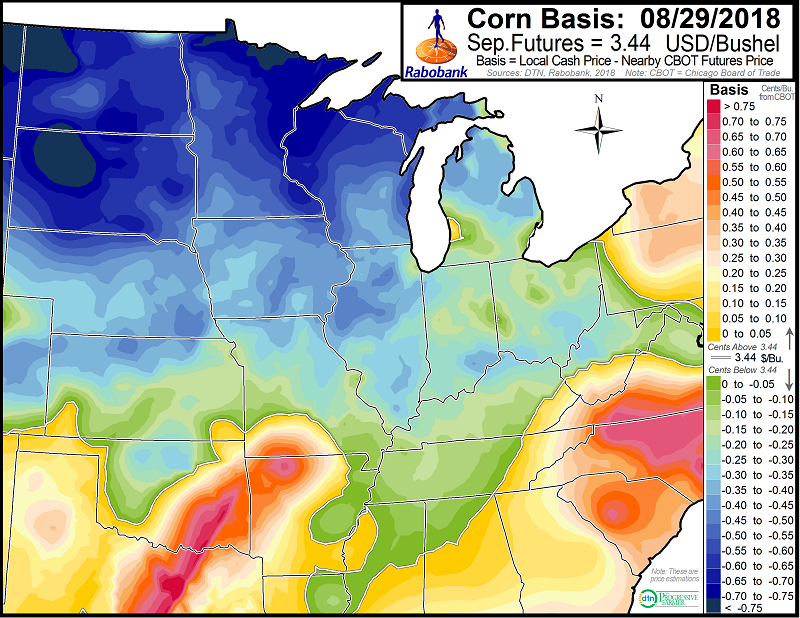
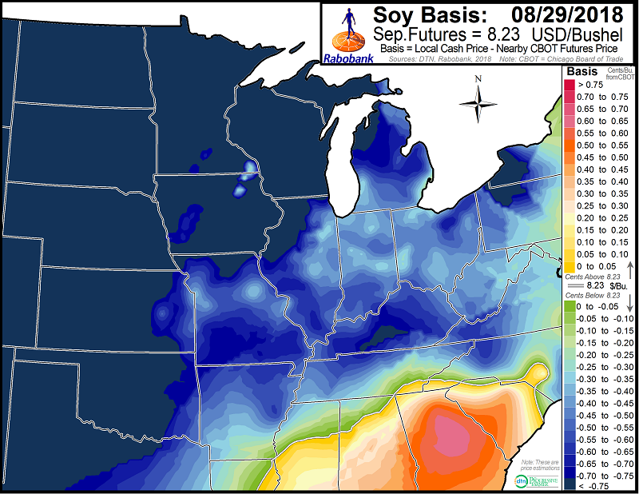
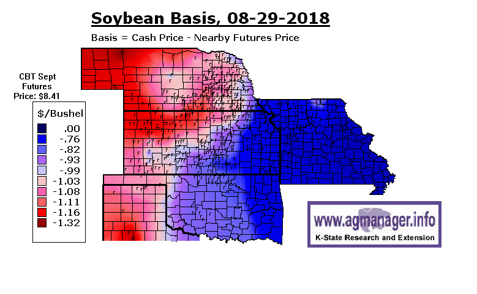

```{r setup, include=FALSE}
knitr::opts_chunk$set(echo=FALSE, fig.keep='high', out.width = '95%', fig.align = 'center', dev='cairo_pdf', warning = FALSE, message = FALSE)

#Load some packages
library(pacman)
pacman::p_load(dplyr)
pacman::p_load(magrittr)
suppressMessages(pacman::p_load(reshape2))
pacman::p_load(Quandl)
suppressMessages(pacman::p_load(lubridate))
pacman::p_load(viridis)
pacman::p_load(Cairo)

#Authentification
Quandl.api_key("2xcmYFJoJKuEDwawuV7J")

#Basic setup for figures
source("Figures/Graph parameters.r")

```

# Definitions: basis
- The *basis* is the difference in price for a commodity at different times and/or locations.
- In this class, most of the time, we will consider that the basis is the difference between the cash price for a commodity and a futures price: $$ \textnormal{Basis = Cash price - Futures price.} $$.
  \vspace{-1\baselineskip}
- It is the \emph{price spread} between the futures and the cash market.
- For example, you can calculate the basis as the difference between the price for corn in the local cash market and the futures price of corn.
- The value of the basis with this definitions has both *time* and *space* components.

# Definitions: basis
- Be careful, sometimes the basis is defined as the difference between the futures price and the cash price.
- Especially true in academic work (textbook).

# Definitions: basis
- Another definition of the basis is the difference in the prices in the cash market at two locations.
    - For example, the difference in fed cattle prices in Canada and in the United States.
- With this definition, the basis only has a space component.
       
# Resources to understand the basis
- Many extension services have published documents that explain the basis in agriculture. It is easy to search on the web for those documents.
    -  An example of such document from Iowa State University Extension and Outreach is available at http://www.extension.iastate.edu/agdm/crops/html/a2-40.html.
    - The Chicago Board of Trade has a document titled *Understanding the basis* that you can find [here](http://www.gofutures.com/pdfs/Understanding-Basis.pdf) or on Canvas.


# Definitions: law of one price
- The *law of one price* says that there is one price for a commodity once accounting for transaction costs.
- *Arbitrage* is the practice of taking advantage of a price difference between two markets to make profit. For example, if the price of soybeans is higher in China than it is in the United-States, an exporter will organize shipments of soybeans if the price difference is sufficiently large to cover transaction costs (e.g. transportation costs).
- Arbitrage between markets through time and space allows for the law of one price to hold.

# Definitions: law of one price
- Examples of transaction costs through time:
    - Interest rate;
    - Storage;
    - Spoilage.
- Examples of transaction costs through space:
    - Transportation cost;
    - Spoilage (heat);
    - Shrinkage (livestock);
    - Death (chicken).

# Explaining the basis
- We will look at explaining the basis between a futures contract and the cash price in two parts:
    - In this section, we will look at the basis through space (location).
    - In a section about storage, we will look at how prices evolve through time.

# Corn basis
```{r corn_basis, echo=FALSE, out.width = '75%'}
download.file("https://www.raboag.com/mm/images/Corn-Basis-Map-800xNAug8.png", "Figures/Basis_corn.png", method = "curl")


```

Source: [Rabo AgriFinance](https://www.raboag.com/rabo-research/weekly-grain-basis-126).


# Corn basis - 2
```{r corn_basis2, echo=FALSE, out.width = '75%'}
download.file("http://www.agmanager.info/sites/default/files/basis_maps/Basiscorn201830.jpg", "Figures/Basis_corn2.jpg", method = "curl")


```

Source: [AgManager.info](http://www.agmanager.info/grain-marketing/crop-basis-maps).

# Soybean basis
```{r soybean_basis, echo=FALSE, out.width = '75%'}
download.file("https://www.raboag.com/mm/images/Soybean-Basis-Map-800xNAug8.png", "Figures/Basis_soybean.png", method = "curl")


```

Source: [Rabo AgriFinance](https://www.raboag.com/rabo-research/weekly-grain-basis-126).


# Soybean basis - 2
```{r soybean_basis2, echo=FALSE, out.width = '75%'}
download.file("http://www.agmanager.info/sites/default/files/basis_maps/Basisbeans201830.jpg", "Figures/Soybean_corn2.jpg", method = "curl")


```

Source: [AgManager.info](http://www.agmanager.info/grain-marketing/crop-basis-maps).

# The basis through space
- The basis between two locations depends on the transaction costs to move the commodity from one location to another.
- The basis informs about local market conditions and tells traders about opportunities to arbitrage the market and make money.


# Trading over the basis
- Traders use the basis to make decisions about where to buy and where to sell.
- Let's look at this with an example (I made up the numbers).
- Consider the basis for corn in Fort Dodge, IA and in Fremont, NE.
- The basis are measured as cash bids for October with respect to the December futures.
-  Suppose that the basis in Fort Dodge is -0.45\$/bu and that the basis in Fremont is -0.51\$/bu.
- Is it possible for a trader to make money by shipping corn between these two locations?

# Trading over the basis
- First, given the two values for the basis, where should a trader buy and sell.
- Recall that the basis is $$ \textnormal{Basis = Cash price - Futures price.} $$
  \vspace{-1\baselineskip}
- The futures price used to calculate the basis is the same for the two locations.
- Because of this, without even knowing the futures prices, we can tell that because the basis is lower in Fremont than in Fort Dodge (-0.51\$/bu $<$ -0.45\$/bu) that the price of corn is lower in Fremont.
- Thus, if the trader buys corn, it will be in Fremont, to sell in Fort Dodge.

# Trading over the basis
- Is there money to make by buying corn in Fremont and selling that corn in Fort Dodge?
- The difference in the basis values is -0.45\$/bu - -0.51\$/bu = 0.06\$/bu.
- Thus, if the shipping cost between Fremont and Fort Dodge is less than 0.06\$/bu, then the trader can make a profit by buying corn in Fremont and selling it in Fort Dodge.
- This is a competitive market and it is likely that the transportation cost is very close to 0.06\$/bu. Traders typically a fraction of a cent per bushel on these transactions.
- There are going to be corn shipped between Fremont and Fort Dodge until the difference in basis exactly equals shipping cost.
- In such a case, all arbitrage opportunities have been exploited.

# Trading over the basis
- Traders are able to make money over small differences in the basis because they can hedge.
- Hedging removes the risk from movement in the futures price.
- We will see how hedging works in the next section.


# When there is no trade between two locations
- Markets are integrated if they are determined by the same market conditions and their prices vary together.
- Two markets are integrated when a commodity flows between one location to the other.
- When markets are integrated, the difference in the basis equals shipping cost (no arbitrage condition).
- If the cost of transportation is very large, then there will be no be trade between the two locations.
    - The difference in the basis (or the difference in the local cash prices) then is smaller than the shipping cost.
    - Prices in the two markets are determined separately at the intersections of their respective supply and the demand curves.
    - The two markets are not integrated.

# When there is no trade between two locations
- It is possible that there is no trade between two markets but that the markets are still integrated.
    - It might just happen that the difference in price equals the transportation cost.
    - It might also be that the two markets both ship the commodity to a third market, making the three markets integrated.
    - For example, both the US and Brazil ship soybeans to China.

# In summary
- The basis summarizes local market conditions.
- Commodities will flow from a location where the basis is low to a location where the basis is high.
- In competitive integrated markets, the difference in basis between two locations will equal shipping cost.

