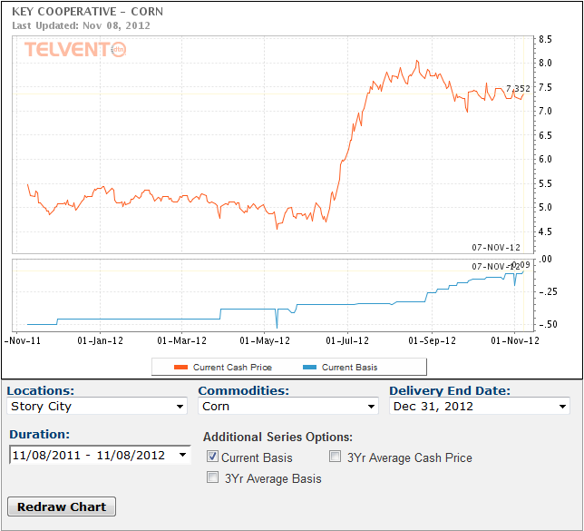

```{r setup, include=FALSE}
knitr::opts_chunk$set(echo=FALSE, fig.keep='high', out.width = '95%', fig.align = 'center', dev='cairo_pdf', warning = FALSE, message = FALSE)

#Load some packages
library(pacman)
pacman::p_load(tidyverse)
pacman::p_load(Quandl)
pacman::p_load(viridis)
pacman::p_load(Cairo)
options(kableExtra.latex.load_packages = TRUE)
pacman::p_load(kableExtra)

#Authentification
#Quandl.api_key("2xcmYFJoJKuEDwawuV7J")

#Basic setup for figures
source("Figures/Graph parameters.r")

```

# Commodity storage

-  Storage plays an important in stabalizing prices through time.
-  The law of one price also applies through time.
    -   Remember that the \emph{law of one price} says that there is one price for a commodity once accounting for transaction costs.
-  Storage allows for arbitrage between the market today and the market at a later time
-  Examples of transaction costs through time:
    -  Interest rate;
    -  Storage;
    -  Spoilage.
   

# Resources to understand the storage

-  [Cost of storing grain](https://www.extension.iastate.edu/agdm/crops/pdf/a2-33.pdf) from ISU extension.
-  [Prices over space and time](http://mindymallory.github.io/PriceAnalysis/prices-over-space-and-time.html) from Mindy Mallory textbook.

# Storage decision

-  To understand the decision to store a commodity, we must compare the price of a commodity today and the expected price for that commodity at a later date.
-  Write the price of a commodity today as $P_t$.
-  Write today's expectations of the price of the commodity in the next period (e.g. next month) is $E_t P_{t+1}$.


# Price expectations

-  Nobody knows the exact price in the next period but everybody can have expectations regarding the price in the next period.
-  Market participants can form their expectations about prices in the future using different methods:
    -  Price paid in the current period;
    -  Projections from economists or other market analysts;
    -  Futures prices;
    -  Other heuristics.
-  The futures price represents what the market thinks the price in the next period will be such that we can write $E_t P_{t+1} = F_t$, where $F_t$ is the current price of a futures contract that expires in the next period.
-  However, an individual trader might not agree and his/her expectations of the future might not be the same as the market. For such a trader, is it possible that $E_t P_{t+1} >F_t$ or $E_t P_{t+1} < F_t$.


# Cost of storage

-  Write that the unit-cost of storage per period for a commodity is $s$.
    -  This includes all costs such as the physical cost of storage, spoilage and insurance.
    -  Assume that it is constant through time (i.e. $s_t = s$).
    -  [Cost of storing grain](https://www.extension.iastate.edu/agdm/crops/pdf/a2-33.pdf) provides values for the cost of storing grains. You can also use an excel sheet to check on the [profitability](https://www.extension.iastate.edu/agdm/cdmarkets.html) of storing grain.
-  Write the interest rate for one period as $r$.
    -  The interest rate is the opportunity cost of holding money over time.
    -  One dollar invested today is worth $1+r$ dollars in the next period.
    -  Or, one dollar in the next period is worth $\beta = \frac{1}{1+r} < 1$ dollars today.
       

# Convenience yield

-  Write that $c_t$ is the \emph{convenience yield} from holding the commodity for one more period.
    -  It represents the gains from the flow of services from holding one unit of the commodity to the next period.
    -  This is a very broad term that captures all sorts of gains from holding the commodity, including the gains from reducing uncertainty and breeding in the case of livestock.
    -  As an example of the existence of a convenience yield, we can look at the [2012-13 crop year](http://usda.mannlib.cornell.edu/usda/waob/wasde//2010s/2013/wasde-08-12-2013.pdf).
-  There is good evidence that the convenience yield exists. To simplify here, assume that equals zero (i.e. $c_t=0$).


# Return to storage

-  The return from selling one unit of the commodity today is $P_t$.
-  The expected return from selling one unit of the commodity in the next period is $\beta (E_t P_{t+1} - s)$.
-  That is, the expected return is the expected price, minus the cost of storage for one period, all in today's dollars.

# Temporal arbitrage

-  For the holder of a storable commodity, the question is *sell today or sell later?*
-  Should sell today if the expected gain is larger then selling in the next period: $$ P_t \ge \beta (E_t P_{t+1} - s).$$
-  Should sell later if the expected gain is larger then selling today: $$ \beta (E_t P_{t+1} - s) \ge P_t.$$
-  The two inequalities above are the intertemporal arbitrage conditions.

# Temporal arbitrage - example

-  Suppose that you can sell corn today at a price of \$3.25/bu.
-  You consider storing a certain quantity of corn. The futures price for corn in March is \$3.90/bu and you expect that the basis in March will be -\$0.25/bu.
-  Your cost of storage from the harvest (October) until March is \$0.35/bu.
-  The annual interest rate is 6\%.
-  Given those expectations, should you store corn?


# Temporal arbitrage - example

-  You expect that you'll be able to sell corn at \$3.65/bu = \$3.90/bu -\$0.25/bu.
-  The interest rate from October to March (5 months) is $0.06*5/12 = 0.025$.
-  A dollar in March is worth $0.9756 = 1/(1+0.025)$.
-  Your expected return is $0.9756 *(\$3.65/bu - \$0.35/bu)= \$3.22/bu$.
-  Given those expectations, should you store corn?

# Temporal arbitrage - example

-  The answer is no, because you can earn \$0.03/bu (\$3.25/bu - \$3.22/bu) more by selling now versus selling in March.
-  You can verify that if you storage cost is \$0.25/bu that it would be profitable for you to store corn between October and March.

# No-arbitrage temporal condition

-  If intertemporal arbitrage holds, it means that $$P_t = \beta (E_t P_{t+1} - s).$$
-  What this expression says is that, because of arbitrage, the market pays the holder of a commodity his cost of carrying the commodity for one period.


# The basis through time

-  Consider the cash price (right now) and the futures price (or the price under a forward contract) for a commodity.
-  Remember that the price of a futures contract represents what the market thinks the price of a commodity will be at the expiration of the contract (i.e. $E_t P_{t+1} = F_t$).
-  To focus on how the basis changes through time, **assume for now that the futures contract specifies a delivery location that is the same as the local cash market.** Thus, we assume for now that there are no spatial issues.
-  Over time, the price of a futures and the cash price will tend to vary together because of intertemporal arbitrage -  if possible.
-  However, will the basis be positive or negative?
-  The only thing that we know for sure is that the basis will be zero when the futures contract expires.


# The basis through time for a storable commodity

-  For a storable commodity, intertemporal arbitrage is possible.
-  This means that the holder of a commodity will make the decision to sell today or wait to sell later.
-  This is possible because of storage.
-  We can find a relationship in the price over time from the cost of storage and the cost of money (interest rate).


# Prices through time for a storable commodity

-  The ability to arbitrage through time for storable commodities creates a relationship between prices over time.
    -  If $$P_t = \beta (F_t - s),$$
    -  and that $$E_t P_{t+1} = \beta (F_{t+1} - s),$$
    -  it means that $$P_t < F_t  < F_{t+1} < ...$$
-  That is, as time goes by, the price of a storable commodity should increase to compensate for the opportunity cost of holding the commodity (cost of storage).


# The basis through time for a storable commodity

-  The further from the expiration of a futures contract, the more negative is the basis.
-  The implication is that the basis will narrow over time when approaching the expiration date of a contract.
-  The relationship between prices at different periods may not hold all the time:
    -  In particular, the relationship may not appear to hold because of changes in expectations regarding future prices. For example, a sudden shock may affect $F_t$.
    -  It may not hold because of different crop seasons.
        

# Example of basis for corn through time \label{Corn_basis}

```{r bull, echo=FALSE, out.width = '55%'}

```
Source: [Key cooperative](http://www.keycoop.com/).

# Information about the basis in Iowa

-  The Extension service here at Iowa State compiled data regarding the basis.
-  The webpage is available [here](http://www.extension.iastate.edu/agdm/crops/html/a2-41.html).
-  [AMS](http://www.ams.usda.gov/mnreports/nw_gr110.txt) publishes regional bases for Iowa.

# Definition: contango

-  A market is in *contango* if the price of futures contract is higher than the price on the spot market.
-  This is also referred as a *positive carrying charge market*.
-  This is a direct consequence of intertemporal arbitrage described earlier.
-  See futures prices on [Barchart](http://www.barchart.com/futures/marketoverview) (not all are good examples).
-  In the same crop year, the difference between futures price and the spot price reflects the price of storage.

# Definition: backwardation

-  The price pattern between cash and futures prices described before may sometimes not hold.
-  A situation where the cash price is higher than the price of a futures contract is referred to as *negative carrying charge* or *normal backwardation*.


# Backwardation

-  Backwardation occurs when  $$P_t \ge \beta (E_t P_{t+1} - s).$$
-  Backwardation is considered abnormal: how can it be sustained if commodity traders arbitrage between periods?
-  One explanation for backwardation is that there is a small number of transactions. In such case, a risk premium might explain the inversion.
    -  In a thin market, buyers may be willing to pay a premium to secure supply early because they fear that they will only be able to buy the commodity in the months ahead at a much higher price later.
    -  The market is not paying for the cost of storage.
-  Another explanation is a short-term shortage of deliverable stocks (i.e. there is no longer any stock available).

# Examples of arbitrage through time: storable commodity

-  Hay bales;
-  Grain elevators;
-  Livestock (storing meat on hooves - possible but not for very long);
-  Apples (perishable but storable for about 8 months);
-  Canning;
-  Beer and cheese are examples of storage.

# What about non-storable commodities?

-  For a non-storable commodity, there is no intertemporal arbitrage:
    -  One cannot hold onto a non-storable commodity in hope of selling it a higher price later.
    -  For examples, fresh fruits can be stored but only for a short period of time.
-  Thus, for non-storable commodities, the basis depends on the current market conditions and the expected conditions and the time of delivery for the futures contract.
-  The markets for the commodity now and in the future are different.
-  There is no link between the market today and the market in the future.

# In summary...

-  The basis for a futures contract has both a time and spatial component.
-  Thinking about the basis through time or through space is the same as it is the transaction cost that determine the basis:
    -  Opportunity cost of holding a commodity through time;
    -  Cost of transportation from one location to another;
    -  Time only moves in one direction.
-  The cash and futures prices may not converge exactly to the same value because:
    -  The local cash market is not a terminal market;
    -  Difference in quality;
    -  Shocks for which the market takes time to adjust to.